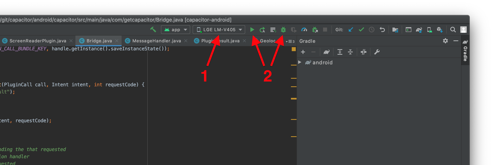

# Capacitor Android Documentation

Capacitor features a native Android runtime that enables developers to communicate between JavaScript and Native Java or Kotlin code.

Capacitor Android apps are configured and managed through Android Studio.

## Android Support

API 23+ (Android 6 or later) is supported, which represents around 99% of the Android market. Capacitor requires an Android WebView with Chrome version 60 or later. On Android 6, and 10+ Capacitor uses the [Android System WebView](https://play.google.com/store/apps/details?id=com.google.android.webview). On Android 7-9, [Google Chrome](https://play.google.com/store/apps/details?id=com.android.chrome) provides the WebView.

## Adding the Android Platform

First, install the `@capacitor/android` package.

```bash
npm install @capacitor/android
```

Then, add the Android platform.

```bash
npx cap add android
```

## Opening the Android Project

To open the project in Android Studio, run:

```bash
npx cap open android
```

Alternatively, you can open Android Studio and import the `android/` directory as an Android Studio project.

## Running Your App

You can either run your app on the command-line or with Android Studio.

> To use an Android Emulator you must use an API 24+ system image. The System WebView does not automatically update on emulators. Physical devices should work as low as API 23 as long as their System WebView is updated.

### Running on the Command-Line

To run the project on a device or emulator, run:

```bash
npx cap run android
```

The command will prompt you to select a target. [Learn more about `run`](/cli/commands/run.md).

> Either a physical Android device or a downloaded emulator system image is required to use the `run` command. See the [documentation here for creating emulator devices and downloading system images in Android Studio](https://developer.android.com/studio/run/managing-avds).

### Running with Android Studio

In Android Studio, first select the device or emulator and then click the run or debug button to run your app. Unless you're debugging Java or Kotlin code, the run button is preferred.



## Troubleshooting

If you encountered any issues while getting started, you can consult the [Android Troubleshooting Guide](/main/android/troubleshooting.md). Feel free to [open a discussion](https://github.com/ionic-team/capacitor/discussions/) if you need help.

## Next Steps

If your app ran you are now ready to continue developing and building your app. Use the various APIs available, Capacitor or Cordova plugins, or custom native code to build out the rest of your app.

## Further Reading

Follow these Android-specific guides for more information on setting permissions for your app, updating dependencies, building plugins, and more:

[Configuring and setting permissions for Android &#8250;](/main/android/configuration.md)

[Building Native Plugins for Android &#8250;](/plugins/creating-plugins/android-guide.md)
