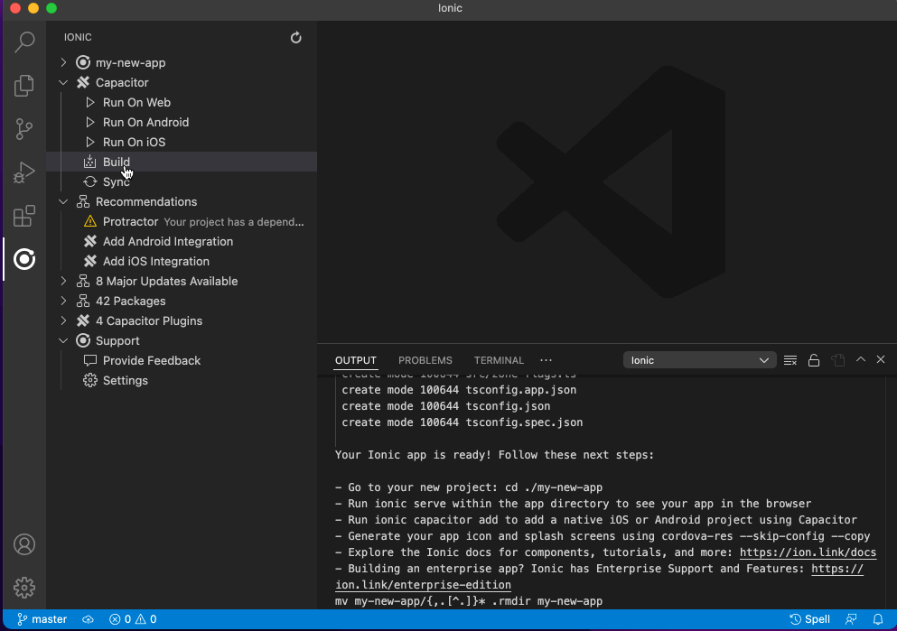
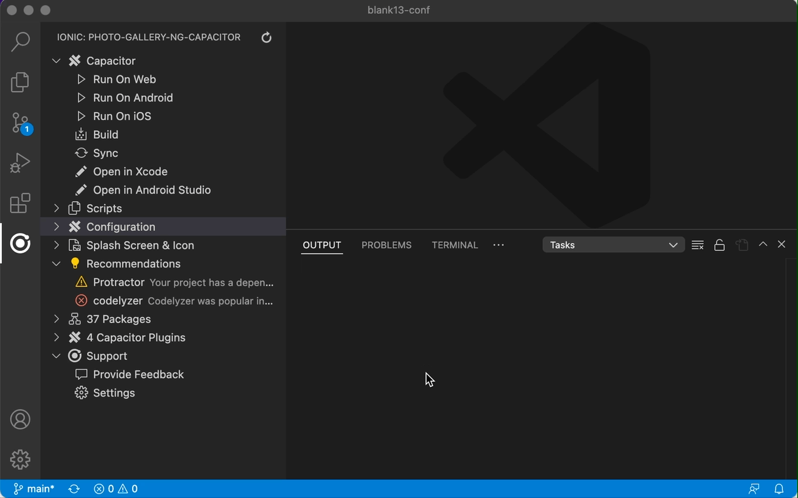

## Using the Ionic/Capacitor VS Code Extension

The Ionic Visual Studio Code extension doubles as an official Capacitor extension, and helps you perform various functions that are common to developing a Capacitor app, all without leaving your VS Code window. You can install the [extension on the Visual Studio Marketplace](https://marketplace.visualstudio.com/items?itemName=ionic.ionic). Once you have the extension installed, you'll see the Ionic logo in the activity bar.

## Integrating Capacitor

You can add [Capacitor](https://capacitorjs.com/) to your existing application by choosing "Integrate Capacitor".

With Capacitor integrated, you can now run your app on web, Android, and iOS with the "Run On Web", "Run On Android", and "Run On iOS" options.

## Migrating from Cordova

If you are [migrating from Cordova to Capacitor](https://capacitorjs.com/docs/cordova/migrating-from-cordova-to-capacitor), the Ionic VS Code extension can speed up that process.

The extension:

- Adds Capacitor's dependencies to your project.
- Flags known, incompatible Cordova packages.
- Removes unrequired Cordova plugins.
- Replaces certain Cordova plugins with equivalent Capacitor plugins
- And more!

This extension will help you follow our guide to migrate off of Cordova and onto Capacitor more easily than before.

## Configuring Native Project Settings

The Ionic VS Code extension can also help you easily configure Android and iOS variables related to your project.

You can easily change the display name, version number, and build number of your application; as well as other configurable values in your project.

## Debugging

Using the Ionic extension, you can run the VS Code debugger on Web, Android, and iOS (coming soon).

Using the options under the Debug folder, you can set breakpoints for both web and native code. Debugging for web will launch a seperate web browser instance that is debuggable (Google Chrome by Default). You can also choose Microsoft Edge from the settings option. On Android, the webview instances will be listed in the "Debug" folder and debuggable in a similar way to Web.

## Doing More

There is so much the Ionic VS Code extension can help with, including migrations, debugging, monorepo support, and more. For the full list of all of the extension's capabilities, checkout the [extension overview on the VS Code Marketplace](https://marketplace.visualstudio.com/items?itemName=ionic.ionic).
