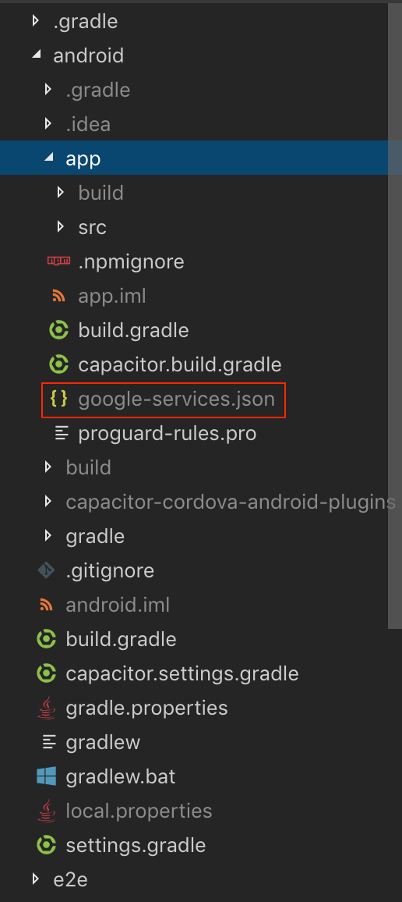
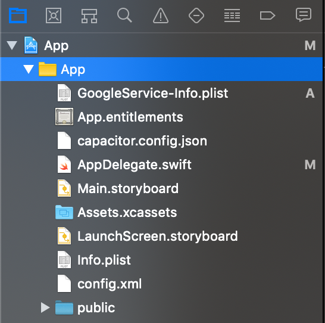
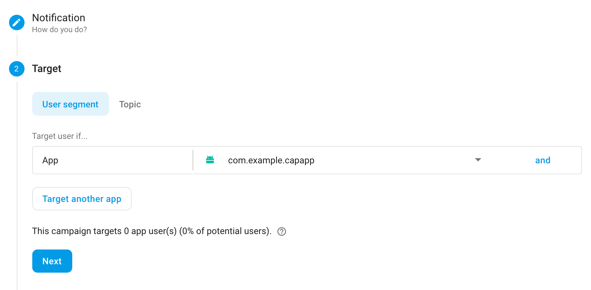
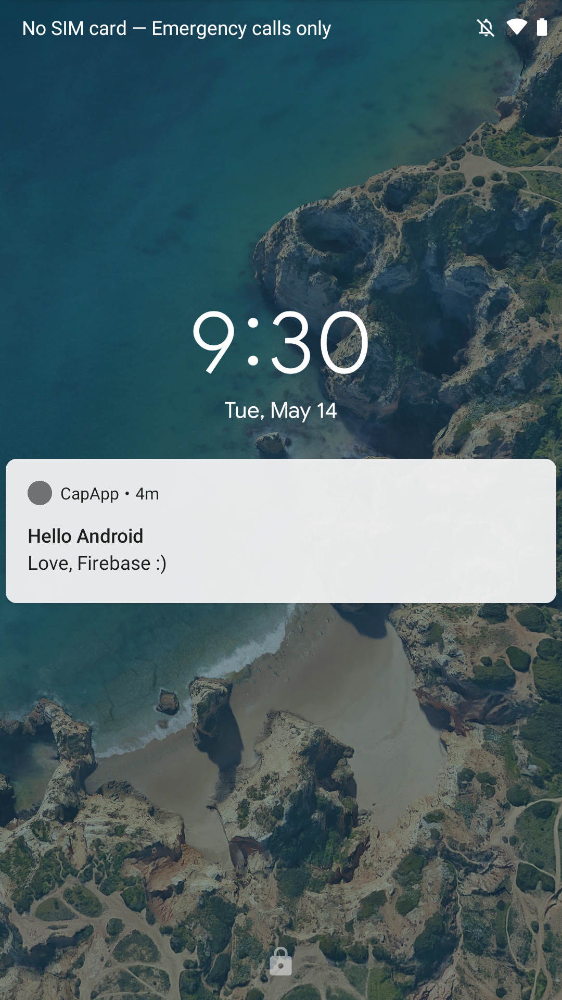
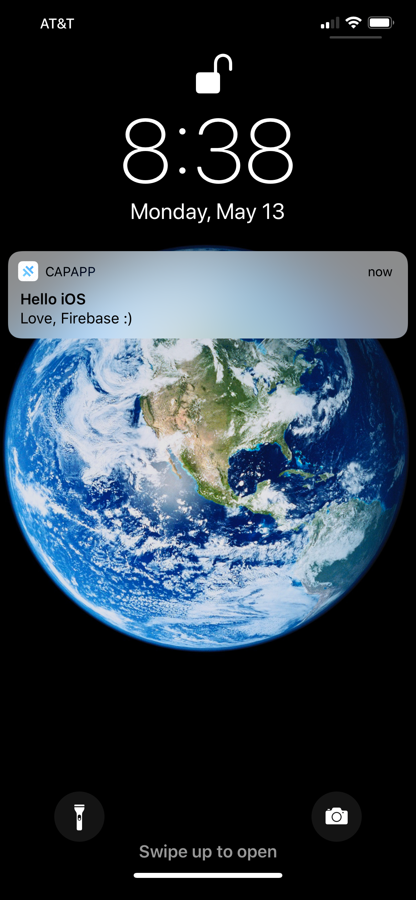
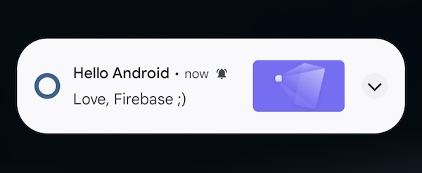

# Using Push Notifications with Firebase in an Ionic + Angular App

**Web Framework**: Angular
**Platforms**: iOS, Android

One of the most common features provided by application developers to their users is push notifications. In this tutorial, we'll walk through all the steps needed to get [Firebase Cloud Messaging](https://firebase.google.com/docs/cloud-messaging) working on iOS and Android.

For the purposes of registering and monitoring for push notifications from Firebase, we'll make use of the [Push Notification API for Capacitor](https://capacitorjs.com/docs/apis/push-notifications) in an Ionic + Angular application.

## Required Dependencies

Building and deploying iOS and Android applications using Capacitor requires a bit of setup. Please [follow the instructions to install the necessary Capacitor dependencies here](/main/getting-started/environment-setup.md) before continuing.

To test push notifications on iOS, Apple requires that you have [a paid Apple Developer account](https://developer.apple.com/).

Also, we're using Firebase for push notifications, so if you're using other Cordova plugins that use the Firebase SDK make sure they're using the latest versions.

## Prepare an Ionic Capacitor App

If you have an existing Ionic app, skip this section. If not, let's create an Ionic app first.

In your preferred terminal, install the latest version of the Ionic CLI:

```bash
npm install -g @ionic/cli
```

Next, let's use the CLI to create a new Ionic Angular app based on the **blank** starter project and call it **capApp**:

```bash
ionic start capApp blank --type=angular
```

Once the application has been created successfully, switch to the newly created project directory:

```bash
cd capApp/
```

Finish up by editing the `appId` in `capacitor.config.ts`.

```diff
const config: CapacitorConfig = {
- appId: 'io.ionic.starter',
+ appId: 'com.mydomain.myappnam',
  appName: 'capApp',
  webDir: 'www'
};
```

## Building the App & Adding Platforms

Before adding any native platforms to this project, the app must be built at least once. A web build creates the web assets directory that Capacitor needs (`www` folder in Ionic Angular projects).

```bash
ionic build
```

Next, let's add the iOS and Android platforms to our app.

```bash
ionic cap add ios
ionic cap add android
```

Upon running these commands, both `android` and `ios` folders at the root of the project are created. These are entirely separate native project artifacts that should be considered part of your Ionic app (i.e., check them into source control).

## Using the Capacitor Push Notification API

First of all, we need to install the Capacitor Push Notifications Plugin

```bash
npm install @capacitor/push-notifications
npx cap sync
```

Then, before we get to Firebase, we'll need to ensure that our application can register for push notifications by making use of the Capacitor Push Notification API. We'll also add an `alert` (you could use `console.log` statements instead) to show us the payload for a notification when it arrives and the app is open on our device.

In your app, head to the `home.page.ts` file and add an `import` statement and a `const` to make use of the Capacitor Push API:

```typescript
import {
  ActionPerformed,
  PushNotificationSchema,
  PushNotifications,
  Token,
} from '@capacitor/push-notifications';
```

Then, add the `ngOnInit()` method with some API methods to register and monitor for push notifications. We will also add an `alert()` a few of the events to monitor what is happening:

```typescript
export class HomePage implements OnInit {
  ngOnInit() {
    console.log('Initializing HomePage');
  
    // Request permission to use push notifications
    // iOS will prompt user and return if they granted permission or not
    // Android will just grant without prompting
    PushNotifications.requestPermissions().then(result => {
      if (result.receive === 'granted') {
        // Register with Apple / Google to receive push via APNS/FCM
        PushNotifications.register();
      } else {
        // Show some error
      }
    });
  
    // On success, we should be able to receive notifications
    PushNotifications.addListener('registration',
      (token: Token) => {
        alert('Push registration success, token: ' + token.value);
      }
    );

    // Some issue with our setup and push will not work
    PushNotifications.addListener('registrationError',
      (error: any) => {
        alert('Error on registration: ' + JSON.stringify(error));
      }
    );

    // Show us the notification payload if the app is open on our device
    PushNotifications.addListener('pushNotificationReceived',
      (notification: PushNotificationSchema) => {
        alert('Push received: ' + JSON.stringify(notification));
      }
    );

    // Method called when tapping on a notification
    PushNotifications.addListener('pushNotificationActionPerformed',
      (notification: ActionPerformed) => {
        alert('Push action performed: ' + JSON.stringify(notification));
      }
    );
  }
}
```

Here is the full implementation of `home.page.ts`:

```typescript
import { Component, OnInit } from '@angular/core';

import {
  ActionPerformed,
  PushNotificationSchema,
  PushNotifications,
  Token,
} from '@capacitor/push-notifications';

@Component({
  selector: 'app-home',
  templateUrl: 'home.page.html',
  styleUrls: ['home.page.scss'],
})
export class HomePage implements OnInit {
  ngOnInit() {
    console.log('Initializing HomePage');

    // Request permission to use push notifications
    // iOS will prompt user and return if they granted permission or not
    // Android will just grant without prompting
    PushNotifications.requestPermissions().then(result => {
      if (result.receive === 'granted') {
        // Register with Apple / Google to receive push via APNS/FCM
        PushNotifications.register();
      } else {
        // Show some error
      }
    });

    PushNotifications.addListener('registration', (token: Token) => {
      alert('Push registration success, token: ' + token.value);
    });

    PushNotifications.addListener('registrationError', (error: any) => {
      alert('Error on registration: ' + JSON.stringify(error));
    });

    PushNotifications.addListener(
      'pushNotificationReceived',
      (notification: PushNotificationSchema) => {
        alert('Push received: ' + JSON.stringify(notification));
      },
    );

    PushNotifications.addListener(
      'pushNotificationActionPerformed',
      (notification: ActionPerformed) => {
        alert('Push action performed: ' + JSON.stringify(notification));
      },
    );
  }
}
```

After this, you'll want to generate a new build and let Capacitor know about the changes. You can do that with:

```bash
ionic build
npx cap copy
```

## Creating a Project for your App on Firebase

Before we can connect Firebase Cloud Messaging to your application and send push notifications, you'll need to start a project in Firebase.

Go to the [Firebase Console](https://console.firebase.google.com/) and click the **Add project** button.

Name the project, accept the Firebase ToS and click **Create project** to continue. A Project ID should be automatically generated for you.

## Android

### Integrating Firebase with the Android app

This section more-or-less mirrors the [setting up Firebase using the Firebase console documentation](https://firebase.google.com/docs/android/setup?authuser=0). See below for specific Capacitor-related notes.

Go to the Project Overview page for your Firebase project and at the top, click on the **Android** icon to add a new android application.


The next screen will ask you for some information about your application.

- Your **Android package name** should match the **appId** from your `capacitor.config.ts` file
- We used `com.mydomain.myappname` for this Capacitor app ID, so that is what we'll use for this entry.
- Nickname and Debug Signing Certificate are optional

Then click the **Register app** button.

### Download and Use the `google-services.json` file

The next prompt will ask you to download a `google-services.json` file. This file contains the information your Capacitor app needs to connect to Firebase from Android.

Download the `google-services.json` file to your local machine. Then move the file into your Capacitor Android project directory, specifically under `android/app/`.



We don't need to _add_ any dependencies to our project because `@capacitor/push-notifications` automatically include a version of `firebase-messaging` in it's `build.gradle` file.

## iOS

### Prerequisites

iOS push notifications are significantly more complicated to set up than Android. You must have a [paid Apple Developer account](https://developer.apple.com/) _and_ take care of the following items prior to being able to test push notifications with your iOS application:

1. [Setup the proper Development or Production certificates & provisioning profiles](https://help.apple.com/xcode/mac/current/#/dev60b6fbbc7) for your iOS application in the Apple Developer Portal
2. [Create an APNS certificate or key](https://developer.apple.com/documentation/usernotifications/setting_up_a_remote_notification_server/establishing_a_certificate-based_connection_to_apns) for either Development or Production in the Apple Developer Portal
3. [Ensure Push Notification capabilities have been enabled](https://help.apple.com/xcode/mac/current/#/dev88ff319e7) in your application in Xcode

### Integrating Firebase with our native iOS app

This part is very similar to the Android section above, with a few key differences.

First, go to the **Project Overview** page for your Firebase project. If you've been following this guide, you'll already have an Android application listed at the top of the page.

To add iOS to your Firebase project, click the **Add App** button and select the **iOS** platform.

The next screen will ask you for some information about your application.

- Your **iOS bundle ID** should match the **appId** from your `capacitor.config.ts` file
- We used `com.mydomain.myappname` for this Capacitor app ID, so that is what we'll use for this entry.
- App Nickname and App Store ID are optional

Then click the **Register app** button.

### Add the `GoogleService-Info.plist` file to your iOS app

_Note: This is **not** the same file used for your Android app._

Download the `GoogleService-Info.plist` provided to your local machine.

You'll then want to open Xcode...

```bash
npx cap open ios
```

... and move the `.plist` file into your Xcode project as instructed by Firebase, ensuring to add it to all targets.



### Add the Firebase SDK via CocoaPods

The Push Notification API on iOS makes use of CocoaPods - an iOS dependency management system - and we need to tell CocoaPods to make use of Firebase.

To do this, we need to modify the `Podfile`, which can be found in Xcode under `Pods`:


We need to add Firebase to the CocoaPods provided for our App target. To do that, add `pod FirebaseMessaging` to your `target 'App'` section, like so:

```ruby
target 'App' do
  capacitor_pods
  # Add your Pods here
  pod 'FirebaseMessaging' # Add this line
end
```

Your `Podfile` should look something like this:

```ruby
require_relative '../../node_modules/@capacitor/ios/scripts/pods_helpers'

platform :ios, '13.0'
use_frameworks!

# workaround to avoid Xcode caching of Pods that requires
# Product -> Clean Build Folder after new Cordova plugins installed
# Requires CocoaPods 1.6 or newer
install! 'cocoapods', :disable_input_output_paths => true

def capacitor_pods
  pod 'Capacitor', :path => '../../node_modules/@capacitor/ios'
  pod 'CapacitorCordova', :path => '../../node_modules/@capacitor/ios'
  pod 'CapacitorApp', :path => '../../node_modules/@capacitor/app'
  pod 'CapacitorHaptics', :path => '../../node_modules/@capacitor/haptics'
  pod 'CapacitorKeyboard', :path => '../../node_modules/@capacitor/keyboard'
  pod 'CapacitorPushNotifications', :path => '../../node_modules/@capacitor/push-notifications'
  pod 'CapacitorStatusBar', :path => '../../node_modules/@capacitor/status-bar'
end

target 'App' do
  capacitor_pods
  # Add your Pods here
  pod 'FirebaseMessaging'
end

post_install do |installer|
  assertDeploymentTarget(installer)
end
```

### Update the Project

Now we'll need to ensure that our iOS project is updated with the proper Firebase CocoaPod installed.

_Note: This part can take a while as CocoaPods needs to download all the appropriate files/dependencies._

```bash
npx cap update ios
```

### Add Initialization Code

To connect to Firebase when your iOS app starts up, you need to add the following to your `AppDelegate.swift` file.

First, add an `import` at the top of the file:

```swift
import FirebaseCore
import FirebaseMessaging
```

... and then add the configuration method for Firebase to initialization code to your `AppDelegate.swift` file, in the `application(didFinishLaunchingWithOptions)` method.

```swift
FirebaseApp.configure()
```

Then you need to add the following two methods to correctly handle the push registration events:

```swift
func application(_ application: UIApplication, didRegisterForRemoteNotificationsWithDeviceToken deviceToken: Data) {
  Messaging.messaging().apnsToken = deviceToken
  Messaging.messaging().token(completion: { (token, error) in
    if let error = error {
        NotificationCenter.default.post(name: .capacitorDidFailToRegisterForRemoteNotifications, object: error)
    } else if let token = token {
        NotificationCenter.default.post(name: .capacitorDidRegisterForRemoteNotifications, object: token)
    }
  })
}

func application(_ application: UIApplication, didFailToRegisterForRemoteNotificationsWithError error: Error) {
  NotificationCenter.default.post(name: .capacitorDidFailToRegisterForRemoteNotifications, object: error)
}
```

Your completed `AppDelegate.swift` file should look something like this:

```swift
import UIKit
import Capacitor
import FirebaseCore
import FirebaseMessaging

@UIApplicationMain
class AppDelegate: UIResponder, UIApplicationDelegate {

  var window: UIWindow?


  func application(_ application: UIApplication, didFinishLaunchingWithOptions launchOptions: [UIApplication.LaunchOptionsKey: Any]?) -> Bool {
    // Override point for customization after application launch.
    FirebaseApp.configure()
    return true
  }

  func application(_ application: UIApplication, didRegisterForRemoteNotificationsWithDeviceToken deviceToken: Data) {
    Messaging.messaging().apnsToken = deviceToken
    Messaging.messaging().token(completion: { (token, error) in
      if let error = error {
          NotificationCenter.default.post(name: .capacitorDidFailToRegisterForRemoteNotifications, object: error)
      } else if let token = token {
          NotificationCenter.default.post(name: .capacitorDidRegisterForRemoteNotifications, object: token)
      }
    })
  }

  func application(_ application: UIApplication, didFailToRegisterForRemoteNotificationsWithError error: Error) {
    NotificationCenter.default.post(name: .capacitorDidFailToRegisterForRemoteNotifications, object: error)
  }
```

### Upload the APNS Certificate or Key to Firebase

If you followed the instructions from the beginning, you'll have created an Apple APNS Certificate or an APNS Auth Key in the Apple Developer portal. You need to upload one of these to Firebase before Firebase can talk to APNS and send push notifications to your application.

To upload your certificate or auth key, from the **Project Overview** page:

1. Click on your iOS application and then the **Settings** gear icon.
2. On the Settings page, click on the **Cloud Messaging** tab.
3. Under the **iOS app configuration** header, upload your Auth Key or Certificate(s) using the provided **Upload** button.

## Sending a Test Notification

Now for the fun part - let's verify that push notifications from Firebase are working on Android and iOS!

We need to fire up our application on Android or iOS so that our `home.page.ts` page can register and receive notifications.

To open your Android project in Android Studio:

```bash
npx cap open android
```

To open your iOS project in Xcode:

```bash
npx cap open ios
```

Once the project is open, side-load the application on your device using the Run feature of either Android Studio or Xcode. The app should start up on the home page.

_Note: On iOS, you will see a popup asking you to allow notifications for your app - make sure you choose to **Allow notifications**!_

If your app successfully registers and you followed the code above, you should see an alert with a success message!

Now we'll test to see if the notifications are received by our device. To send a notification, in Firebase, go to the **Cloud Messaging** section under the Grow header in the project pane.

Next, select the **New Notification** button.

When creating the notification, you only need to specify the following information:

1. The text of the notification
2. The title (Android only, optional for iOS)
3. The Target (either a user segment or topic; I recommend just targeting the iOS or Android app itself, see below)



4. The Scheduling (leave this to "Now")

At that point, you can **Review** the notification you've put together and select **Publish** to send the notification out.

If you've setup your application correctly, you'll see an alert pop up on your home screen with the push notification you composed in Firebase. You can then tap on the notification and you should get an `alert` for the `pushActionPerformed` event, per our code above.





## Images in Push Notifications

You can optionally include Images as part of push notification by following the guide below.

:::tip
The Firebase Messaging SDK can include an `ImageUrl` property as part of its payload and will display it. The url must be `https://` and be sized under 300kb.
:::

### Images with Android
Android will automatically display images when using `@capacitor/push-notifications`. If you test this in [Firebase Console](https://console.firebase.google.com/) by setting `Notification image` the push notification will appear on the Android device similar to the screenshot below:



### Images with iOS
iOS requires a [Notification Service Extension](https://developer.apple.com/documentation/usernotifications/unnotificationserviceextension) to be added to your project in order to display images in push notifications.

In XCode:
- Click `File` > `New` > `Target`
- Choose `Notification Service Extension` and click `Next`
- Enter a `Product Name` (for example `pushextension`)
- Select your Team
- Click `Finish`
- When asked click `Activate`

Choose `pushextension` from the list of Targets then:
- Click `Signing & Capabilities`
- Click `+ Capability`
- Choose `Push Notifications`
- Change the Deployment target from `iOS 16.4` (or whatever Xcode chose) to `iOS 13.0`

:::note
 If you do not change the deployment target for your extension then images will not appear on devices on an older version of iOS.
:::

To add Firebase Messaging to the extension open your `Podfile` and add:
```ruby
target 'pushextension' do
  pod 'FirebaseMessaging'
end
```

Then update Cocoapods by running:
```bash
npx cap update ios
```

Now open `NotificationService.swift` (it will be in the folder named `pushextension`) and replace the contents with the following:

```swift
import UserNotifications
import FirebaseMessaging

class NotificationService: UNNotificationServiceExtension {
    var contentHandler: ((UNNotificationContent) -> Void)?
    var bestAttemptContent: UNMutableNotificationContent?

    override func didReceive(_ request: UNNotificationRequest, withContentHandler contentHandler: @escaping (UNNotificationContent) -> Void) {
        guard let content = request.content.mutableCopy() as? UNMutableNotificationContent else { return }
        self.contentHandler = contentHandler
        self.bestAttemptContent = content
        
        FIRMessagingExtensionHelper().populateNotificationContent(content, withContentHandler: contentHandler)
    }
    
    override func serviceExtensionTimeWillExpire() {
        guard let contentHandler = contentHandler,
              let bestAttemptContent =  bestAttemptContent else { return }
        
        contentHandler(bestAttemptContent)
    }
}
```

You should now test a push notification from the [Firebase Console](https://console.firebase.google.com/) remembering to set the `Notification image` and choose your iOS app. When it arrives on the iOS device it will appear on the right hand side as shown below:


