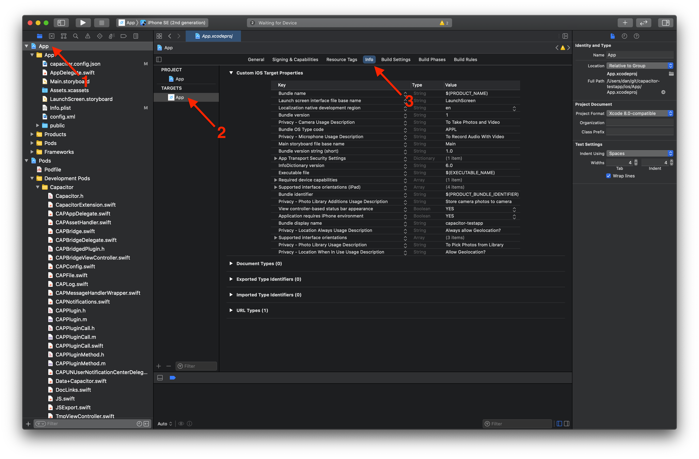
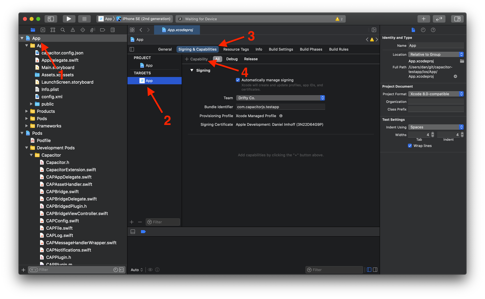
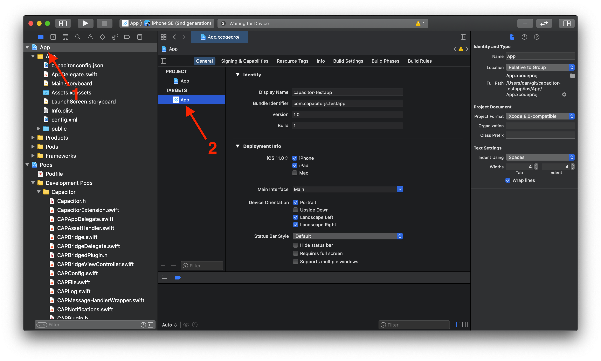

# 配置 iOS

## 配置 `Info.plist`

`Info.plist` 文件是 iOS 应用的主要配置文件。当 Capacitor 插件需要新设置或权限时，您可能需要编辑此文件。

要修改它，请[在 Xcode 中打开您的项目](/main/ios/index.md#打开-ios-项目)，选择 **App** 项目和 **App** 目标，然后点击 **Info** 标签页。



> 您可以通过在表格中右键单击并勾选上下文菜单中的 **Raw Keys & Values** 来显示真实的键名。
>
> 您也可以手动打开和编辑 `ios/App/App/Info.plist` 文件来查看原始键名。使用[此参考文档](https://developer.apple.com/library/archive/documentation/General/Reference/InfoPlistKeyReference/Introduction/Introduction.html)查看可能的键名列表。

## 管理权限

iOS 权限不需要像 Android 那样明确指定。但是，iOS 要求在 `Info.plist` 中定义“使用说明”。这些设置是可读的描述，将在请求特定设备 API 权限时展示给最终用户。

查阅 [Cocoa Keys](https://developer.apple.com/library/content/documentation/General/Reference/InfoPlistKeyReference/Articles/CocoaKeys.html) 列表，寻找包含 `UsageDescription` 的键，以查看应用可能需要的各种使用说明设置。

更多信息，Apple 提供了[解决隐私敏感数据应用拒绝](https://developer.apple.com/library/content/qa/qa1937/_index.html)指南，其中包含需要使用说明的 API 的更多信息。

## 设置功能

功能用于启用应用可能需要的核心特性。当 Capacitor 插件需要时，您可能需要配置它们。

与其他配置选项和使用说明不同，功能**不**在 `Info.plist` 中配置。

要添加新功能，请[在 Xcode 中打开您的应用](/main/ios/index.md#打开-ios-项目)，选择 **App** 项目和 **App** 目标，点击标签栏中的 **Signing & Capabilities**，然后点击 **+ Capability** 按钮。有关 iOS 功能的更多信息，请参阅[此文章](https://developer.apple.com/documentation/xcode/adding_capabilities_to_your_app)。



## 重命名您的应用

您不能重命名 `App` 目录，但可以通过重命名 **App** 目标来设置应用名称。

要重命名 **App** 目标，请[在 Xcode 中打开您的项目](/main/ios/index.md#打开-ios-项目)，选择 **App** 项目，然后双击 **App** 目标。



然后，打开 `ios/App/Podfile` 并重命名文件底部的当前目标：

```diff
-target 'App' do
+target 'MyRenamedApp' do
   capacitor_pods
   # 在此处添加您的 Pods
 end
```

最后，在 [Capacitor 配置文件](/main/reference/config.md#schema)的 `ios` 对象内添加 `scheme` 属性。

## 深度链接（又称通用链接）

关于深度链接指南，[请参阅此处](/main/guides/deep-links.md)。