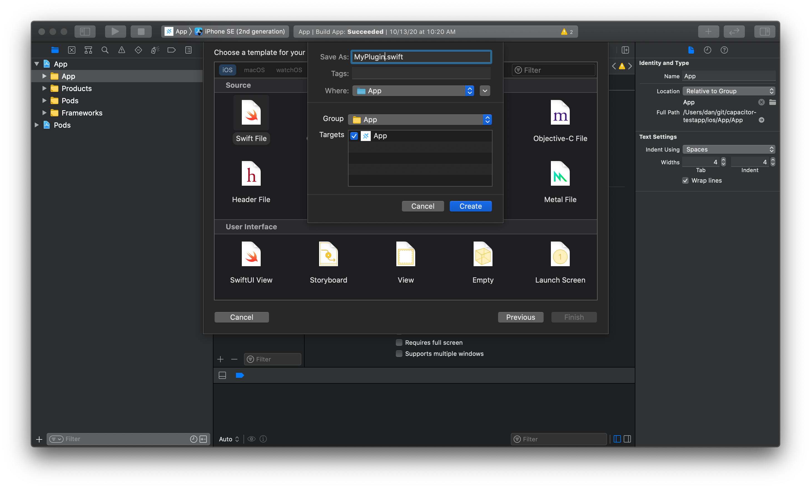

# 自定义原生 iOS 代码

借助 Capacitor，我们鼓励您编写 Swift 或 Objective-C 代码来实现应用所需的本机功能。

可能并非所有功能都有[现成的 Capacitor 插件](/plugins.mdx)——但这没关系！您完全可以直接在应用中编写可供 WebView 访问的原生代码。

## WebView 可访问的原生代码

在 JavaScript 和原生代码之间进行通信的最简单方式，是构建一个专属于您应用的本地自定义 Capacitor 插件。

### `EchoPlugin.swift`

首先，按照以下步骤创建 `EchoPlugin.swift` 文件：[打开 Xcode](/main/ios/index.md#opening-the-ios-project)，右键点击 **App** 分组（位于 **App** 目标下），从上下文菜单中选择 **New File...**，在窗口中选择 **Swift File**，然后创建该文件。



将以下 Swift 代码复制到 `EchoPlugin.swift` 中：

```swift
import Capacitor

@objc(EchoPlugin)
public class EchoPlugin: CAPPlugin, CAPBridgedPlugin {
    public let identifier = "EchoPlugin"
    public let jsName = "Echo"
    public let pluginMethods: [CAPPluginMethod] = [
        CAPPluginMethod(name: "echo", returnType: CAPPluginReturnPromise)
    ]

    @objc func echo(_ call: CAPPluginCall) {
        let value = call.getString("value") ?? ""
        call.resolve(["value": value])
    }
}
```

> `@objc` 装饰器是必需的，以确保 Capacitor 运行时（必须使用 Objective-C 来实现动态插件支持）能够识别它。

### 注册插件

我们必须在 iOS 和 Web 两端注册自定义插件，以便 Capacitor 能够在 Swift 和 JavaScript 之间建立桥梁。

#### `MyViewController.swift`

[创建一个自定义的 `MyViewController.swift`](../ios/viewcontroller.md)。

然后重写 `capacitorDidLoad()` 方法并注册插件：

```swift
override open func capacitorDidLoad() {
    bridge?.registerPluginInstance(EchoPlugin())
}
```

#### JavaScript

在 JavaScript 中，我们使用 `@capacitor/core` 中的 `registerPlugin()` 来创建一个与 Swift 插件关联的对象。

```typescript
import { registerPlugin } from '@capacitor/core';

const Echo = registerPlugin('Echo');

export default Echo;
```

> `registerPlugin()` 的第一个参数是插件名称，必须与 `EchoPlugin.swift` 中的 `jsName` 一致。

**TypeScript**

我们可以通过定义一个接口并将其用于 `registerPlugin()` 调用，来为关联的对象定义类型。

```diff
 import { registerPlugin } from '@capacitor/core';

+export interface EchoPlugin {
+  echo(options: { value: string }): Promise<{ value: string }>;
+}

-const Echo = registerPlugin('Echo');
+const Echo = registerPlugin<EchoPlugin>('Echo');

 export default Echo;
```

`registerPlugin()` 的泛型参数定义了关联对象的结构。如果需要，您可以使用 `registerPlugin<any>('Echo')` 来忽略类型。我们不做评判。❤️

### 使用插件

使用导出的 `Echo` 对象来调用插件方法。以下代码片段将在 iOS 上调用 Swift 代码并打印结果：

```typescript
import Echo from '../path/to/echo-plugin';

const { value } = await Echo.echo({ value: 'Hello World!' });
console.log('Response from native:', value);
```

### 后续步骤

[阅读 iOS 插件指南 &#8250;](/plugins/creating-plugins/ios-guide.md)