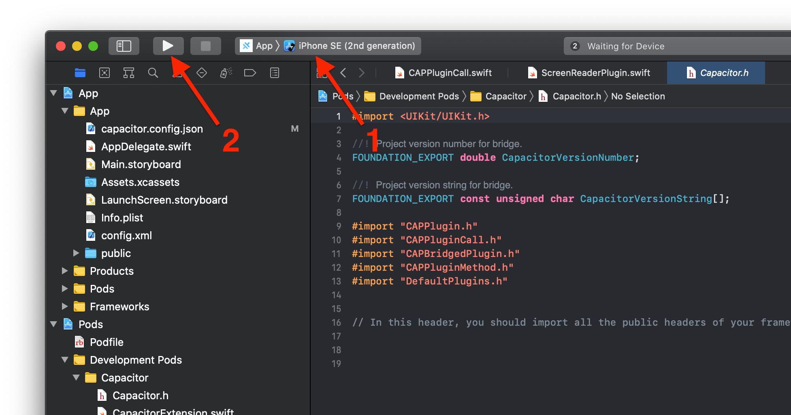

# Capacitor iOS 文档

Capacitor 提供原生的 iOS 运行时环境，使开发者能够在 JavaScript 与原生 Swift 或 Objective-C 代码之间进行通信。

Capacitor iOS 应用通过 Xcode 和 [CocoaPods](https://cocoapods.org/) 进行配置和管理。

## iOS 支持

支持 iOS 14+ 系统。需要 Xcode 16.0+ 版本（详见[环境设置](/main/getting-started/environment-setup.md#ios-requirements)）。Capacitor 使用 [WKWebView](https://developer.apple.com/documentation/webkit/wkwebview)，而非已弃用的 [UIWebView](https://developer.apple.com/documentation/uikit/uiwebview)。

## 添加 iOS 平台

首先，安装 `@capacitor/ios` 包。

```bash
npm install @capacitor/ios
```

然后，添加 iOS 平台。

```bash
npx cap add ios
```

## 打开 iOS 项目

要在 Xcode 中打开项目，请运行：

```bash
npx cap open ios
```

或者，您也可以手动运行以下命令打开 Xcode：

```bash
open ios/App/App.xcworkspace
```

## 运行您的应用

您可以通过命令行或 Xcode 运行应用。

### 在命令行中运行

要在设备或模拟器上运行项目，请执行：

```bash
npx cap run ios
```

该命令会提示您选择目标设备。[了解更多关于 `run` 命令的信息](/cli/commands/run.md)。

### 在 Xcode 中运行

在 Xcode 中，首先选择设备或模拟器，然后点击播放按钮运行应用。



## 故障排除

如果在入门过程中遇到任何问题，您可以查阅 [iOS 故障排除指南](/main/ios/troubleshooting.md)。如需帮助，欢迎[发起讨论](https://github.com/ionic-team/capacitor/discussions/)。

## 后续步骤

您现在可以继续开发和构建您的应用了。使用各种可用的 API、Capacitor 或 Cordova 插件，或自定义原生代码来完成应用的其余部分。

## 延伸阅读

如需了解更多相关信息，请参阅以下指南：

[配置 iOS 及设置权限 &#8250;](/main/ios/configuration.md)

[为 iOS 构建原生插件 &#8250;](/plugins/creating-plugins/ios-guide.md)