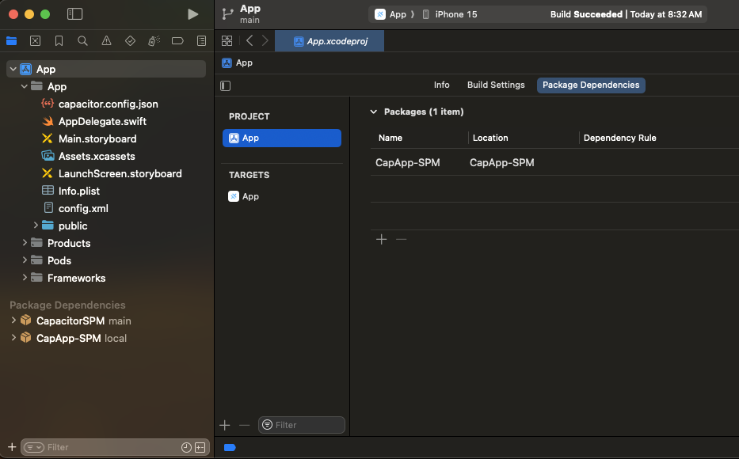
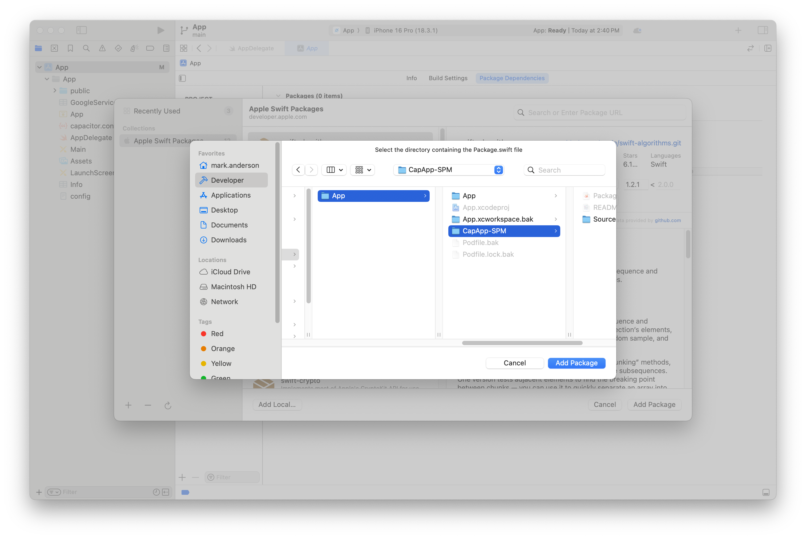
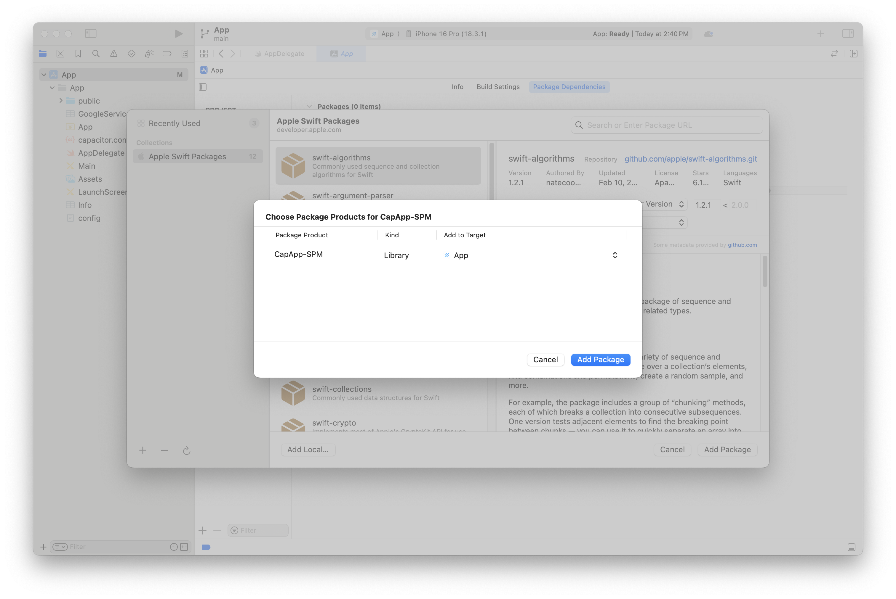
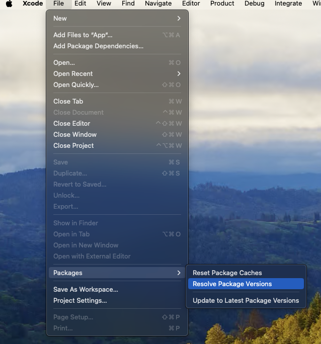

# Swift Package Manager

Swift Packages are Apple's new first-party tool for software dependencies. Traditionally Capacitor has used CocoaPods for managing dependencies internally and for plugins, however now is the time to move to a supported solution.

Since Capacitor 6, you can choose between using CocoaPods or Swift Package Manager (SPM). Almost all current capacitor-team supported plugins support SPM, namely the plugins in <a href="https://github.com/ionic-team/capacitor-plugins">capacitor-plugins</a>.

We've tried our best to make sure you don't have to change much about how you work with Capacitor to use SPM, but there are a few things to understand.

## How it works

When a Capacitor project is using SPM we use a 'Base SPM' package that will serve as the place that references all of your projects dependencies:

The Capacitor CLI will modify the CapAPP-SPM package when you sync new plugins. It is important you do not touch the contents here because the CLI can and will change things.

## Using SPM in a new Capacitor project

First we'll start with our normal `npm init @capacitor/app@latest`:

Now we want to add the iOS platform to our project:

`npm install @capacitor/ios`

Next let's build the web project:

`npm run build`

After that is complete we can add the iOS project. We need to add the option `--packagemanager SPM` to the normal add command:

`npx cap add ios --packagemanager SPM`

Now you can use `npx cap open ios` to open the iOS project and run your app from there.

---

### Add and use a Capacitor Plugin with SPM

So let's add a plugin to this project and do something with that plugin. 

Start with installing the Capacitor App plugin:

`npm install @capacitor/app`

Then let's sync the web app. This will add the App plugin SPM to the iOS project:

`npx cap sync`

You can now use the App plugin normally.

## Using SPM in an existing Capacitor Project

### Using our migration tool

The Capacitor CLI has a command to help migrate from CocoaPods to Swift Package Manager. However, one manual step is still required. In addition, projects with Cordova plugins will not be migrated correctly and neither will projects that use plugins that do not have SPM versions available.

To start, run `npx cap migrate-to-spm` in the root of your project.

This tool will:
  - Run `pod deintegrate` removing CocoaPods
  - Delete the `Podfile`, `App.xcworkspace`, and `Podfile.lock`
  - Create a `CapApp-SPM` directory with the needed files
  - Generate a `Package.swift` from your plugins, and warn you if any can't included. 

After this is run, run a `npx cap sync` again.

Then run `npx cap open ios` and you should see something similar to this:

Highlight App, and Select the Package Dependencies tab, and on this page press the + symbol to add a dependency:

You should see something similar to the below - select Add Local... from the dialog:

Select CapApp-SPM in this dialog and click Add Package:

Click Add Package again when this screen shows up: 

When you are done, you should see a screen like this. At this point you're done and can build and work as normal:

### Converting existing plugins to SPM

More details soon, but check this repository out: https://github.com/ionic-team/capacitor-plugin-converter

### Troubleshooting

After adding plugins try to 'reset package caches' in Xcode:

