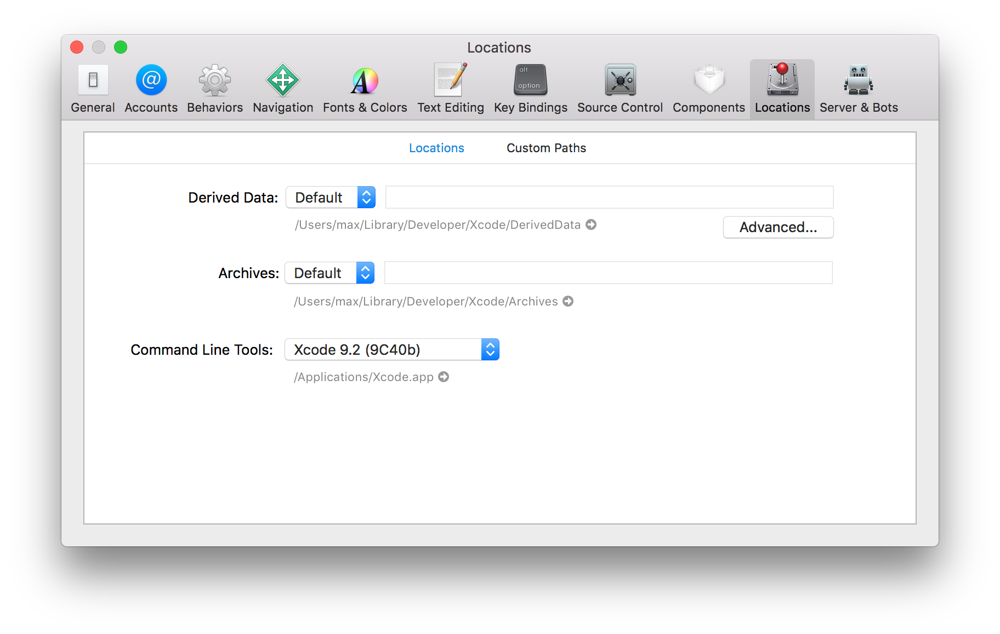
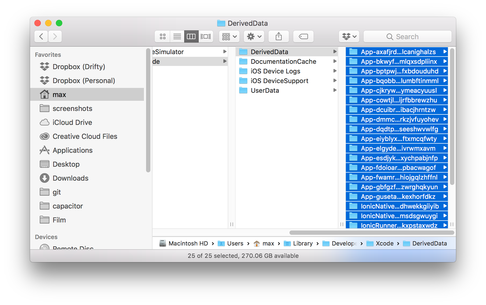
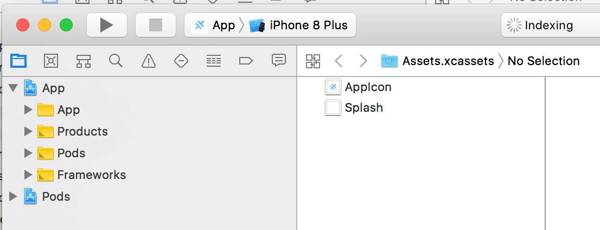

# iOS 疑难解答指南

要打造一个百分之百完美的原生管理工具几乎是不可能的，在 iOS 工作流程中，你迟早会遇到各种问题。

本指南旨在记录常见的 iOS/Xcode 问题及其可能的解决方案。

## iOS 工具箱

每位 iOS 开发者都会掌握一些常见的调试技巧，你应该将这些方法融入你的工作流程中：

### 谷歌搜索，再搜索，再搜索

每当遇到 iOS 或 Xcode 的问题时，你的第一步应该是将错误信息复制粘贴到谷歌搜索中。

Capacitor 使用的是标准的 iOS 工具链，因此很可能你遇到的问题，许多 iOS 开发者也曾遇到过，并且已有解决方案。

可能只需要更新依赖、清理项目或删除 Derived Data 就能解决。

### 清理与重建

清理并重新构建可以解决许多构建问题。在 Xcode 菜单中导航至 Product -> Clean Build Folder 来清理当前的构建。

### 删除 Derived Data

有时，Xcode 会保留旧的、过时的构建产物。要重新开始，你需要删除磁盘上的所有 Derived Data。

为此，打开 Xcode 偏好设置，选择 Locations 标签页，然后点击 Derived Data 路径旁边的小箭头：



这会打开一个 Finder 窗口，显示 Xcode 临时 Derived Data 的位置。

接下来，选择该目录中的所有项目并删除：



最后，在 Xcode 中重新构建。

## 错误：沙盒与 Podfile.lock 不同步

如果 CocoaPods 未能运行以安装依赖项，可能会发生此错误。

运行以下命令来更新你的 pods：

```bash
npx cap update ios
```

运行此命令后执行新的构建。

## 无限索引

Xcode 有时会陷入无限索引的状态。这种不幸的情况看起来像这样：



唯一的解决方案是强制关闭 Xcode（使用活动监视器）并重新启动。

## CocoaPods：无法连接到 GitHub

在安装了旧版本 openssl 和 ruby 的 Mac 上可能会出现此错误，因为 GitHub 在访问仓库时限制了允许的加密协议。

解决方案是更新 openssl 和 Ruby：

```bash
brew install openssl
brew upgrade openssl
brew install ruby
brew link --overwrite ruby
```

最后，确保你的 `PATH` 环境变量没有将 `/usr/local/bin` 放在 `$PATH` 之后，而是放在其之前。

关于此问题的其他可能解决方案，请参阅[此 StackOverflow 问题](https://stackoverflow.com/questions/38993527/cocoapods-failed-to-connect-to-github-to-update-the-cocoapods-specs-specs-repo/48996424#48996424)。

## 插件未实现

在 iOS 上，如果 Capacitor 找不到插件或无法将其代码注入到 WebView 中，可能会发生此问题。

首先，确保插件已安装并出现在 `package.json` 中。

然后，运行 `npx cap sync ios`。

最后，检查插件是否在 `ios/App/Podfile` 中。如果插件未列出，请确保你的 Podfile 看起来像[这个示例](https://github.com/ionic-team/capacitor/blob/main/ios-pods-template/App/Podfile)，并再次运行 `npx cap sync`。

如果仍然遇到“插件未实现”错误，请确保 `ios/App/App/Info.plist` 中没有 `WKAppBoundDomains` 键，这会阻止 Capacitor 和插件代码的注入。如果不需要，请移除该键；如果无法移除，请在 capacitor 配置文件的 `ios` 对象中添加 `limitsNavigationsToAppBoundDomains` 并设置为 `true`。