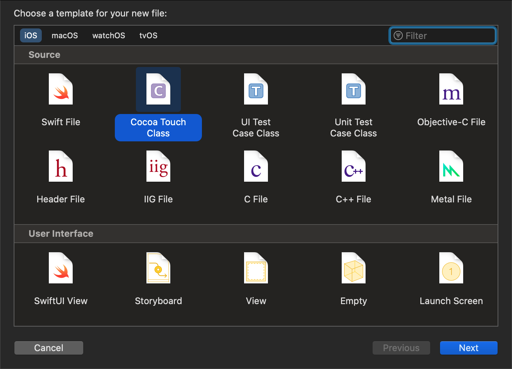
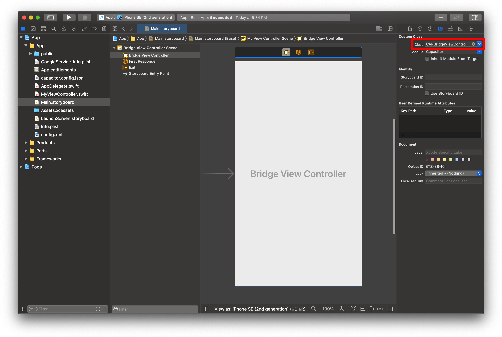

# 自定义 ViewController

自 Capacitor 3.0 起，您可以在应用程序中对 `CAPBridgeViewController` 进行子类化。大多数应用并不需要此功能，但它为处理某些使用场景提供了官方支持方案。

## 何时需要创建子类

需要进行子类化的典型场景包括：运行时覆盖 Capacitor 的配置值、修改 [`WKWebViewConfiguration`](https://developer.apple.com/documentation/webkit/wkwebviewconfiguration) 的属性、为 Capacitor 替换自定义的 [`WKWebView`](https://developer.apple.com/documentation/webkit/wkwebview) 子类、集成需要在 [`viewDidLoad()`](https://developer.apple.com/documentation/uikit/uiviewcontroller/1621495-viewdidload) 中添加代码的第三方 SDK、在原生视图显示前进行操控，或[注册自定义插件](../ios/custom-code.md)。

如需创建自定义子类，请按以下步骤操作：

### 创建 `MyViewController.swift`

首先通过[打开 Xcode](/main/ios/index.md#opening-the-ios-project) 创建 `MyViewController.swift` 文件：右键点击 **App** 组（位于 **App** 目标下），从上下文菜单中选择 **New File...**，在弹出的窗口中选择 **Cocoa Touch Class**，在后续界面中将 **Subclass of:** 设置为 `UIViewController`，最后保存文件。




### 编辑 `Main.storyboard`

接着，在项目导航器中选中 `Main.storyboard` 文件，在 **Bridge View Controller Scene** 中选择 **Bridge View Controller**，在右侧选择 **Identity Inspector**，并将自定义类名更改为 `MyViewController`。



### 编辑 `MyViewController.swift`

最后，在项目导航器中选中 `MyViewController.swift` 文件，编辑它以导入 Capacitor 并更改父类：

```swift
import UIKit
import Capacitor

class MyViewController: CAPBridgeViewController {
    // 自定义代码
}
```

完成！

### 后续步骤

Xcode 在生成文件时应该已经为您创建了 `viewDidLoad()` 方法，但请查阅 [`CAPBridgeViewController`](https://github.com/ionic-team/capacitor/blob/main/ios/Capacitor/Capacitor/CAPBridgeViewController.swift) 中的内联文档，以找到您可能需要的 Capacitor 特定方法。任何标记为 `open` 的方法都明确允许子类进行重写。