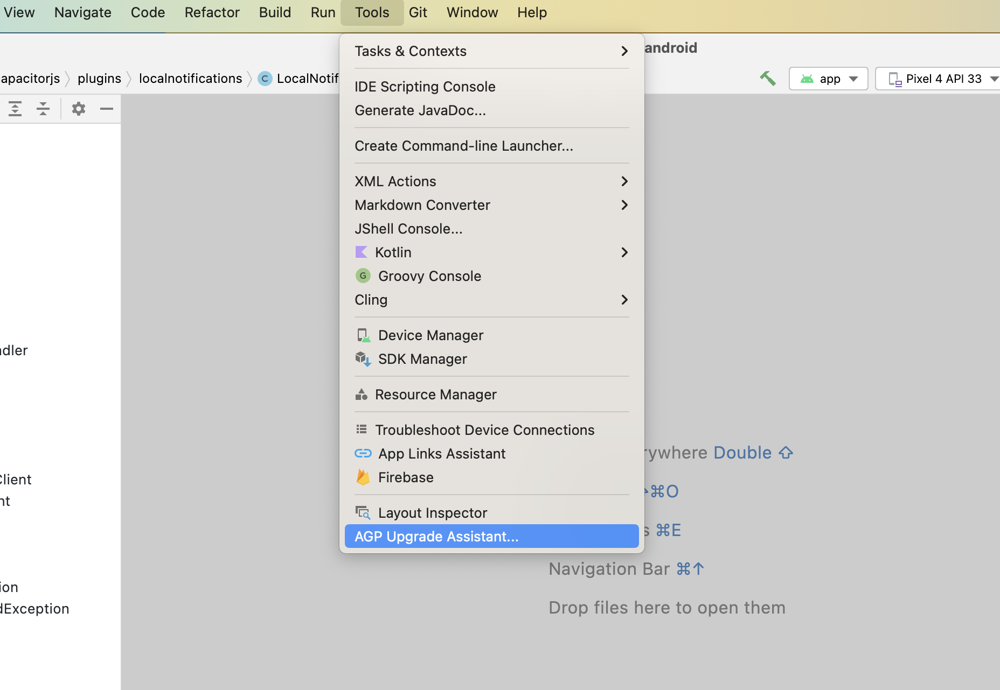

# Updating from Capacitor 4 to Capacitor 5

Compared to previous upgrades, the breaking changes between Capacitor 4 and 5 are extremely minimal. In this guide, you'll find steps to update your project to the current Capacitor 5 version as well as a list of breaking changes for our official plugins.

## Using the CLI to Migrate

Install the latest version of the Capacitor CLI to your project using `npm i -D @capacitor/cli@latest`. Once installed, simply run `npx cap migrate` to have the CLI handle the migration for you. If any of the steps for the migration are not able to be completed, additional information will be made available in the output in the terminal. The steps for doing the migration manually are listed out below.

## iOS

The following guide describes how to upgrade your Capacitor 4 iOS project to Capacitor 5.

### Upgrade Xcode

Capacitor 5 requires Xcode 14.1+.

### Update .gitignore

Make the following changes to your `.gitignore` file:

```diff
+ App/output 
- App/Podfile.lock
```

### Update Assets to use a single app icon

Xcode 14 supports a single app icon of 1024x1024, so you can clean up your AppIcon.appiconset by removing all unnecessary sizes.


## Android

The following guide describes how to upgrade your Capacitor 4 Android project to Capacitor 5.

Android Studio can assist with some of the updates related to gradle and moving package into build files.  To start, run `Tools -> AGP Upgrade Assistant`.



### Update Android Project Variables

In your `variables.gradle` file, update your values to the following new minimums

```groovy
minSdkVersion = 22
compileSdkVersion = 33
targetSdkVersion = 33
androidxActivityVersion = '1.6.1'
androidxAppCompatVersion = '1.6.1'
androidxCoordinatorLayoutVersion = '1.2.0'
androidxCoreVersion = '1.9.0'
androidxFragmentVersion = '1.5.5'
coreSplashScreenVersion = '1.0.0'
androidxWebkitVersion = '1.6.0'
junitVersion = '4.13.2'
androidxJunitVersion = '1.1.5'
androidxEspressoCoreVersion = '3.5.1'
cordovaAndroidVersion = '10.1.1'
```

### Update Google Services

```diff
# build.gradle

    dependencies {
        classpath 'com.android.tools.build:gradle:7.4.1'
+       classpath 'com.google.gms:google-services:4.3.15'
-       classpath 'com.google.gms:google-services:4.3.13'

```

### Update gradle plugin to 7.4.1

```diff
# build.gradle

    dependencies {
-       classpath 'com.android.tools.build:gradle:7.2.1'
+       classpath 'com.android.tools.build:gradle:7.4.1'
        classpath 'com.google.gms:google-services:4.3.15'   

```

### Update gradle wrapper to 7.5

```diff
# gradle-wrapper.properties

distributionBase=GRADLE_USER_HOME
distributionPath=wrapper/dists
- distributionUrl=https\://services.gradle.org/distributions/gradle-7.4.2-all.zip
+ distributionUrl=https\://services.gradle.org/distributions/gradle-7.5-all.zip
zipStoreBase=GRADLE_USER_HOME
zipStorePath=wrapper/dists
```

### Disable Jetifier

```diff 
# gradle.properties

# Android operating system, and which are packaged with your app's APK
# https://developer.android.com/topic/libraries/support-library/androidx-rn
android.useAndroidX=true
- # Automatically convert third-party libraries to use AndroidX
- android.enableJetifier=true
```

### Move package to `build.gradle`

```diff
# AndroidManifest.xml

<?xml version="1.0" encoding="utf-8"?>
- <manifest xmlns:android="http://schemas.android.com/apk/res/android"
-     package="[YOUR_PACKAGE_ID]">
+ <manifest xmlns:android="http://schemas.android.com/apk/res/android">
```

```diff
# build.gradle

android {
+     namespace "[YOUR_PACKAGE_ID]"
      compileSdkVersion rootProject.ext.compileSdkVersion
```

### Update androidScheme

In Capacitor 6, `https` is going to be the default setting for `androidScheme` for __existing apps__.  To avoid data loss as a result of this change, you should set the scheme to `http` now even if it's the current default.

## Plugins

The following plugin functionality has been modified or removed. Update your code accordingly.

### Device

- `DeviceId.uuid` changed to `DeviceId.identifier`
- On iOS 16+, `DeviceInfo.name` will return a generic device name unless you add the appropriate [entitlements](https://developer.apple.com/documentation/bundleresources/entitlements/com_apple_developer_device-information_user-assigned-device-name).

### Push Notifications

- Android 13 requires a permission check in order to receive push notifications. You are required to call `checkPermissions()` and `requestPermissions()` accordingly, when targeting SDK 33.

### Local Notifications

- Android 13 requires a permission check in order to schedule local notifications. You are required to call `checkPermissions()` and `requestPermissions()` accordingly, when targeting SDK 33.

### Status Bar

- On iOS, the default status bar animation has been changed to `FADE`.