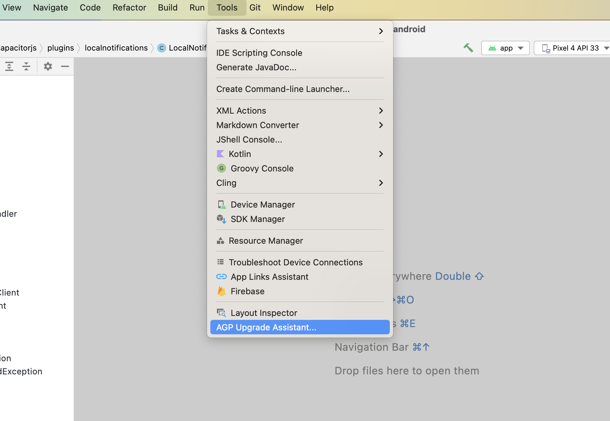

# Updating from Capacitor 8 to Capacitor 9

In this guide, you'll find steps to update your project to the current Capacitor 9 version as well as a list of breaking changes for our official plugins.

:::note
This guide covers app-level changes. If you maintain a Capacitor plugin, see [Updating plugins to 9.0](/main/updating/plugins/9-0.md) instead.
:::

## Cordova support is now optional

Capacitor's Cordova compatibility layer is now only included in your app when your project actually has a Cordova plugin installed. Previously, the native Cordova runtime (the `capacitor-cordova-android` Gradle module and plugins module on Android, and the `CapacitorCordova` CocoaPods pod / SPM product on iOS) was always bundled into every app, whether or not it used any Cordova plugins.

Running `npx cap sync` (or `update`) now detects whether any installed plugin is a Cordova plugin and only wires in the Cordova runtime when one is found. If your project has no Cordova plugins, you'll notice:

- On Android, the generated `settings.gradle` and app `build.gradle` no longer include the `capacitor-cordova-android` / `capacitor-cordova-android-plugins` modules.
- On iOS, `CapacitorCordova` is no longer added to your `Podfile` or `Package.swift`.

There is currently no configuration option to force-include the Cordova runtime when no Cordova plugin is present. If your app's native code (or a plugin you maintain) directly references symbols from Capacitor's Cordova compatibility layer — for example `com.getcapacitor.cordova.CordovaPlugin` on Android, or anything from the `CapacitorCordova` pod/product on iOS — without having an actual Cordova plugin installed, those references will fail to resolve after upgrading. Add a Cordova plugin dependency (even a trivial one) if you need the layer present, or remove the direct reference.

## Breaking changes in @capacitor/cli

`cap run`'s separate live-reload flags (`--live-reload`/`-l`, `--host`, `--port`, `--https`) have been merged into a single `--url` flag. Instead of:

```sh
npx cap run android -l --host 192.168.1.181 --port 5173
```

pass the full URL your dev server printed (Vite, webpack, etc.) directly:

```sh
npx cap run android --url http://192.168.1.181:5173
```

## NodeJS 24+

Capacitor 9 requires NodeJS 24 or greater. (Latest LTS version is recommended.) Node 24 also comes with npm 11 by default, as opposed to npm 10 with Node 22.

## Using the CLI to Migrate

Capacitor 9 hasn't reached general availability yet, so install the `next` version of the Capacitor CLI to your project (once 9.0.0 is generally available, use `@latest` instead):

```sh
npm i -D @capacitor/cli@next
```

Once installed, simply run the following to have the CLI handle the migration for you.

```sh
npx cap migrate
```

If any of the steps for the migration are not able to be completed, additional information will be made available in the output in the terminal. The steps for doing the migration manually are listed out below.

## Breaking changes in @capacitor/android

`androidx.core:core` 1.19.0 folds `core-ktx` into itself, and AGP 9 bundles the Kotlin Gradle Plugin natively while Gradle 9 fully removes `jcenter()`. These rarely affect an app directly, unless you (or an old/community plugin) still pin an old `core-ktx` version, apply Kotlin standalone, or reference `jcenter()` — see [Migrate core-ktx to core](#migrate-core-ktx-to-core) and [Update Kotlin and remove jcenter()](#update-kotlin-and-remove-jcenter) below.

## Breaking changes in @capacitor/ios

If you're updating from Capacitor 8.4 or earlier, you also need to adopt the iOS UIScene lifecycle, which Xcode 27 requires — see [Updating to 8.5](/main/updating/8-5.md) for the full steps. Apps already on 8.5 have nothing further to do here.

Capacitor 9 also removes the Swift and Objective-C APIs that were deprecated in previous major versions. If your app or plugin still uses any of them, replace them as follows.

### `CAPBridge` compatibility class removed

The `CAPBridge` class was a compatibility shim and has been removed entirely. Use the replacements below:

| Removed | Replacement |
| :------ | :---------- |
| `CAPBridge.statusBarTappedNotification` | `Notification.Name.capacitorStatusBarTapped` |
| `CAPBridge.getLastUrl()` | `ApplicationDelegateProxy.shared.lastURL` |
| `CAPBridge.handleOpenUrl(_:_:)` | `ApplicationDelegateProxy.shared.application(_:open:options:)` |
| `CAPBridge.handleContinueActivity(_:_:)` | `ApplicationDelegateProxy.shared.application(_:continue:restorationHandler:)` |
| `CAPBridge.handleAppBecameActive(_:)` | No longer needed, it was a no-op |

### Bridge (`CAPBridgeProtocol`) methods removed

| Removed | Replacement |
| :------ | :---------- |
| `getWebView()` | `webView` property |
| `isSimulator()` | `isSimEnvironment` property |
| `isDevMode()` | `isDevEnvironment` property |
| `getStatusBarVisible()` / `setStatusBarVisible(_:)` | `statusBarVisible` property |
| `getStatusBarStyle()` / `setStatusBarStyle(_:)` | `statusBarStyle` property |
| `setStatusBarAnimation(_:)` | `statusBarAnimation` property |
| `getUserInterfaceStyle()` | `userInterfaceStyle` property |
| `getLocalUrl()` | `config.localURL` |
| `getSavedCall(_:)` | `savedCall(withID:)` |
| `releaseCall(callbackId:)` | `releaseCall(withID:)` |
| `presentVC(_:animated:completion:)` | `viewController?.present(_:animated:completion:)` |
| `dismissVC(animated:completion:)` | `viewController?.dismiss(animated:completion:)` |
| `modulePrint(_:_:)` | `CAPLog.print(_:)` |

### Other removals

| Removed | Replacement |
| :------ | :---------- |
| `CAPNotifications` enum | `Notification.Name.capacitor*` constants (e.g. `Notification.Name.capacitorOpenURL`) |
| `PluginCallErrorData`, `PluginResultData` and `JSResultBody` typealiases | `PluginCallResultData` |
| `CAPPluginCall.hasOption(_:)` | Typed accessors (`getString(_:)`, `getInt(_:)`, etc.) |
| `JSDate.toString(_:)` | No longer needed, dates are mapped to strings during serialization |
| `InstanceConfiguration.getPluginConfigValue(_:_:)` | `getPluginConfig(_:)` |
| `InstanceConfiguration.getValue(_:)` / `getString(_:)` | Direct property accessors on `InstanceConfiguration` |
| `CAPPlugin.getConfigValue(_:)` | `getConfig()` and the typed accessors on `PluginConfig` |
| `CAPFileManager.getPortablePath(host:uri:)` | `portablePath(fromLocalURL:)` on the bridge |
| `CapacitorBridge` initializer taking `cordovaConfiguration` | The initializer without the `cordovaConfiguration` parameter |
| `CapacitorBridge.httpsInterceptorStartIdentifier` | `httpInterceptorStartIdentifier`, all proxied requests are handled by it |
| `CapacitorUrlRequest.setRequestHeaders([String: String])` | `setRequestHeaders([String: Any])`. Note: the replacement sets header values instead of appending them, so repeated keys overwrite the previous value |

## iOS

The following guide describes how to upgrade your Capacitor 8 iOS project to Capacitor 9.

### Upgrade Xcode

Capacitor 9 requires Xcode 27 or newer.

### Raise iOS Deployment Target

Capacitor 9 requires iOS 16.0 or greater.

Do the following for your Xcode project: select the **Project** within the project editor and open the **Build Settings** tab. Under the **Deployment** section, change **iOS Deployment Target** to **iOS 16.0**. Repeat the same steps for any app **Targets**.

Then, if the project is using CocoaPods, open `ios/App/Podfile` and update the iOS version to 16.0:

```ruby
platform :ios, '16.0'
```

### Replace @UIApplicationMain with @main

Swift 6 (bundled with Xcode 27) rejects the deprecated `@UIApplicationMain` attribute. If your `AppDelegate.swift` still declares it, replace it with `@main`:

```diff
-@UIApplicationMain
+@main
class AppDelegate: UIResponder, UIApplicationDelegate {
```

:::note
CocoaPods Trunk is expected to become read-only on December 2, 2026. If you haven't already, consider [migrating your app to SPM](/main/ios/spm.md#using-spm-in-an-existing-capacitor-project), which is the default for new Capacitor projects.
:::

## Android

The following guide describes how to upgrade your Capacitor 8 Android project to Capacitor 9.

### Upgrade Android Studio

Capacitor 9 requires Android Studio 2025.3.3 or newer.

Once it's updated, Android Studio can assist with some of the updates related to gradle. To start, run `Tools -> AGP Upgrade Assistant` and choose `9.2.1` as the version to update on dropdown. Then click `Run selected steps`.



### Update Android Project Variables

In your `variables.gradle` file, update your values to the following new minimums

```groovy
minSdkVersion = 26
compileSdkVersion = 37
targetSdkVersion = 37
androidxActivityVersion = '1.13.0'
androidxAppCompatVersion = '1.7.1'
androidxCoordinatorLayoutVersion = '1.3.0'
androidxCoreVersion = '1.19.0'
androidxFragmentVersion = '1.8.9'
coreSplashScreenVersion = '1.2.0'
androidxWebkitVersion = '1.16.0'
junitVersion = '4.13.2'
androidxJunitVersion = '1.3.0'
androidxEspressoCoreVersion = '3.7.0'
cordovaAndroidVersion = '15.0.0'
```

### Remove targetSdkVersion from your app's build.gradle

AGP 9 infers `targetSdkVersion` from `compileSdkVersion` when it isn't set explicitly, therefore you can remove it:

```diff
defaultConfig {
    applicationId "com.getcapacitor.app"
    minSdkVersion rootProject.ext.minSdkVersion
-   targetSdkVersion rootProject.ext.targetSdkVersion
    versionCode 1
    versionName "1.0"
}
```

### Rename the default ProGuard file

AGP 9 removed `proguard-android.txt`. In your `app/build.gradle`, replace it with `proguard-android-optimize.txt`, which also enables ProGuard optimizations:

```diff
buildTypes {
    release {
        minifyEnabled false
-       proguardFiles getDefaultProguardFile('proguard-android.txt'), 'proguard-rules.pro'
+       proguardFiles getDefaultProguardFile('proguard-android-optimize.txt'), 'proguard-rules.pro'
    }
}
```

### Migrate core-ktx to core

`androidx.core:core` 1.19.0 merges every extension function previously shipped in `core-ktx` into `core` itself, turning `core-ktx` into an empty compatibility artifact. If your app (or an old/community plugin it depends on) still explicitly depends on `core-ktx` with a version older than `1.19.0`, you may hit a duplicate class error at build time; remove it, or depend on `core` instead:

```diff
dependencies {
-   implementation "androidx.core:core-ktx:1.17.0"
+   implementation "androidx.core:core:1.19.0"
}
```

### Update Kotlin and remove jcenter()

AGP 9 bundles the Kotlin Gradle Plugin natively (Kotlin `2.2.10`) instead of requiring it to be applied as a separate plugin. If your `build.gradle` still applies `kotlin-android` directly or declares a standalone `kotlin-stdlib`/`kotlin-gradle-plugin` dependency, remove them — keeping them alongside AGP 9's built-in Kotlin causes a duplicate-plugin build failure:

```diff
buildscript {
    dependencies {
        classpath 'com.android.tools.build:gradle:9.2.1'
-       classpath "org.jetbrains.kotlin:kotlin-gradle-plugin:2.2.20"
    }
}
-apply plugin: 'kotlin-android'

dependencies {
-   implementation "org.jetbrains.kotlin:kotlin-stdlib:2.2.20"
}
```

Gradle 9 also fully removes the `jcenter()` repository helper (redirected to Maven Central since 2024). Any `build.gradle` that still calls it fails at Gradle configuration time:

```diff
repositories {
    google()
-   jcenter()
+   mavenCentral()
}
```

### Update google services plugin

```diff
# build.gradle

    dependencies {
        classpath 'com.android.tools.build:gradle:9.2.1'
-       classpath 'com.google.gms:google-services:4.4.4'
+       classpath 'com.google.gms:google-services:4.5.0'

```

### Update gradle plugin to 9.2.1

```diff
# build.gradle

    dependencies {
-       classpath 'com.android.tools.build:gradle:8.13.0'
+       classpath 'com.android.tools.build:gradle:9.2.1'

```

### Update gradle wrapper to 9.5.1

```diff
# gradle-wrapper.properties

distributionBase=GRADLE_USER_HOME
distributionPath=wrapper/dists
- distributionUrl=https\://services.gradle.org/distributions/gradle-8.14.3-all.zip
+ distributionUrl=https\://services.gradle.org/distributions/gradle-9.5.1-all.zip
zipStoreBase=GRADLE_USER_HOME
zipStorePath=wrapper/dists
```

## Plugins

Plugins have been updated to version 9.0.0, make sure to update them to use latest version.

The following plugin functionality has been modified or removed. Update your code accordingly.

### Action Sheet

- `androidxMaterialVersion` variable has been updated to `1.14.0`.

### Barcode Scanner

- `kotlinxCoroutinesVersion` variable has been updated to `1.11.0`.

### Browser

- `androidxBrowserVersion` variable has been updated to `1.10.0`.

### Camera

- `androidxExifInterfaceVersion` variable has been updated to `1.4.2`.
- `androidxMaterialVersion` variable has been updated to `1.14.0`.

### Geolocation

- `playServicesLocationVersion` variable has been updated to `21.4.0`.
- `kotlinxCoroutinesVersion` variable has been updated to `1.11.0`.

### Google Maps

- `kotlinxCoroutinesVersion` variable has been updated to `1.11.0`.
- `googleMapsPlayServicesVersion` variable has been updated to `20.0.0`.
- `googleMapsUtilsVersion` variable has been updated to `5.0.0`.
- `googleMapsKtxVersion` and `googleMapsUtilsKtxVersion` variables have been updated to `6.0.1`.

### InAppBrowser

- `androidxBrowserVersion` variable has been updated to `1.10.0`.

### Push Notifications

The deprecated `alert` presentation option is no longer supported on iOS. Use `banner` and/or `list` instead.

### Splash Screen

The default value of `launchFadeOutDuration` on Android has changed from `200` to `0`, since the previous default could block UI changes made immediately after `SplashScreen.hide()`. If your app relies on the previous 200ms fade-out animation, set `launchFadeOutDuration: 200` explicitly in your Capacitor config.
