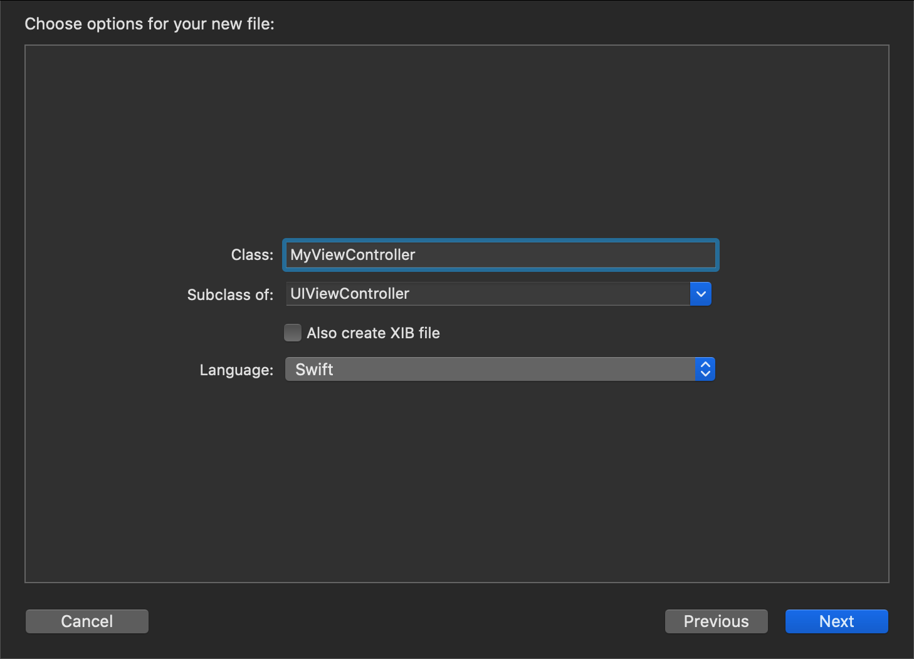

# Custom ViewController

With Capacitor 3.0, you can now subclass `CAPBridgeViewController` within your application. Most applications do not need this feature but it provides a supported mechanism for addressing some unusual use-cases.

## When to create a subclass

Some examples of when subclassing would be necessary are overriding Capacitor's configuration values at run-time, changing the properties of the [`WKWebViewConfiguration`](https://developer.apple.com/documentation/webkit/wkwebviewconfiguration), subsituting a custom subclass of [`WKWebView`](https://developer.apple.com/documentation/webkit/wkwebview) for Capacitor to use, integrating a 3rd party SDK that suggests adding code to [`viewDidLoad()`](https://developer.apple.com/documentation/uikit/uiviewcontroller/1621495-viewdidload), or manipulating native views before they appear onscreen.

If you do need to create a custom subclass, there are a couple of steps to get started.

### Create `MyViewController.swift`

First, create a `MyViewController.swift` file by [opening Xcode](/main/ios/index.md#opening-the-ios-project), right-clicking on the **App** group (under the **App** target), selecting **New File...** from the context menu, choosing **Cocoa Touch Class** in the window, set the **Subclass of:** to `UIViewController` in the next screen, and save the file.




### Edit `Main.storyboard`

Next, select the `Main.storyboard` file in the Project Navigator, select the **Bridge View Controller** in the **Bridge View Controller Scene**, select the **Identity Inspector** on the right, and change the name of the custom class to `MyViewController`.


### Edit `MyViewController.swift`

Finally, select the `MyViewController.swift` file in the Project Navigator and edit it to import Capacitor and change the parent class:

```swift
import UIKit
import Capacitor

class MyViewController: CAPBridgeViewController {
    // additional code
}
```

You're done!

### Next Steps

Xcode should have already created a `viewDidLoad()` method for you when it generated the file but look over the inline documentation in [`CAPBridgeViewController`](https://github.com/ionic-team/capacitor/blob/3.x/ios/Capacitor/Capacitor/CAPBridgeViewController.swift) to find the Capacitor-specific methods you might need. Anything marked `open` is explicitly exposed for subclasses to override.
