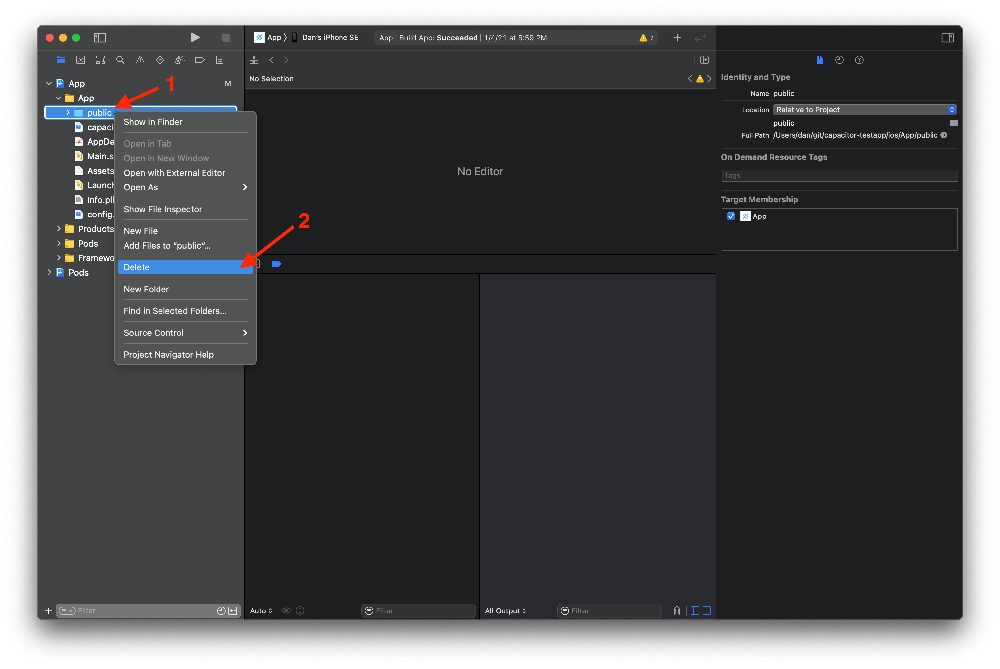
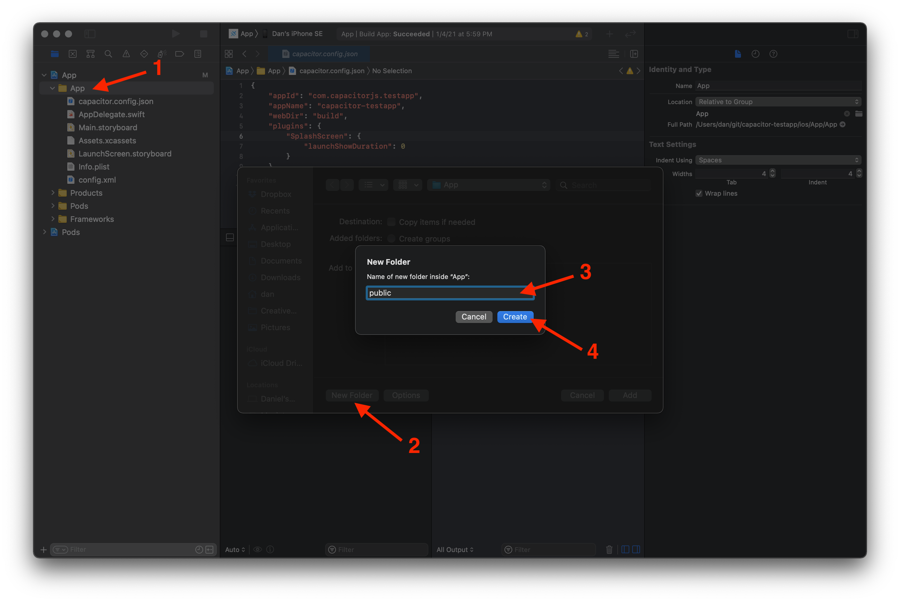

# Updating Capacitor to 3.0 in your app

Capacitor 3 brings crucial updates to the ecosystem and exciting new features.

[Read the Capacitor 3.0 announcement &#8250;](https://ionicframework.com/blog/announcing-capacitor-3-0/)

> After upgrading your app to Capacitor 3, would you mind sharing any feedback you have in [this discussion](https://github.com/ionic-team/capacitor/discussions/3994)? We'd love to hear from you! 💖

If you're a plugin author looking to upgrade your plugins to newer Capacitor versions, see the [Upgrade Guide for Capacitor Plugins](/main/updating/plugins/3-0.md).

## NodeJS 12+

Node 8 has reached end-of-life. Node 10 will reach end-of-life on April 30th, 2021. Capacitor 3 requires NodeJS 12 or greater. (Latest LTS version is recommended.)

## Ionic CLI

If you are using the Ionic CLI, official Capacitor 3 support starts at version 6.16.0. We suggest upgrading to the latest version at this time via `npm install -g @ionic/cli`.

## Update Capacitor CLI and Core

```bash
npm install @capacitor/cli@latest-3 @capacitor/core@latest-3
```

## ES2017+

Capacitor 3 now builds for ES2017 environments, instead of ES5. The [plugin template has also been updated](https://github.com/ionic-team/capacitor/pull/3427/files#diff-b22b3d0cbb7d8f6fdfe1f6f1d9e84b7d) to target ES2017, and third-party plugins are encouraged to update their targets.

This change should not affect your app unless you are supporting IE11, which Capacitor does not officially support.

## TypeScript 3.8+

Capacitor 3 uses a newer TypeScript syntax which can only be used in TS 3.8 or later.

## Capacitor Config changes

If you have TypeScript 3.8+ installed, you can migrate your `capacitor.config.json` to be a typed TypeScript config file named `capacitor.config.ts`. You can continue using a `.json` file, but a typescript config file may give a better developer experience for your team. Below is an example `capacitor.config.ts` file that is used in the [Capacitor Test App](https://github.com/ionic-team/capacitor-testapp).

```typescript
/// <reference types="@capacitor/local-notifications" />
/// <reference types="@capacitor/push-notifications" />
/// <reference types="@capacitor/splash-screen" />

import { CapacitorConfig } from '@capacitor/cli';

const config: CapacitorConfig = {
  appId: 'com.capacitorjs.app.testapp',
  appName: 'capacitor-testapp',
  webDir: 'build',
  plugins: {
    SplashScreen: {
      launchAutoHide: false,
    },
    LocalNotifications: {
      smallIcon: 'ic_stat_icon_config_sample',
      iconColor: '#CE0B7C',
    },
    PushNotifications: {
      presentationOptions: ['alert', 'sound'],
    },
  },
};

export default config;
```

## Official Plugins

All plugins have been removed from Capacitor core and placed into their own npm packages. There are several reasons for this (see [#3227](https://github.com/ionic-team/capacitor/issues/3227)) and the core team is confident this is the right way to go. You can import core plugins like so.

```typescript
import { Camera } from '@capacitor/camera';
```

### Background Task, Permissions, and Photos plugins removed

- **Background Task**: This plugin appeared to be rarely used and didn't quite work as most devs expected. The core team will readdress background functionality in the future. Subscribe to [#3032](https://github.com/ionic-team/capacitor/issues/3032) for updates.
- **Permissions**: The core team has implemented an alternative to this centralized approach which community plugins may also adopt (see the [new Permissions API](/plugins/creating-plugins/web-guide.md#permissions)).
- **Photos**: This undocumented iOS-only plugin has been removed. Use [`@capacitor-community/media`](https://github.com/capacitor-community/media).

### Accessibility, App, and Modals plugins split up

- **Accessibility**
  - VoiceOver and TalkBack functionality moved into [**Screen Reader**](/apis/screen-reader.md)
- **App**
  - App-related info and functionality remains in [**App**](/apis/app.md)
  - App URL handling (`openUrl()` and `canOpenUrl()`) moved into [**App Launcher**](/apis/app-launcher.md)
- **Modals**
  - Action Sheet functionality (`showActions()`) moved into [**Action Sheet**](/apis/action-sheet.md)
  - Dialog window functionality (`alert()`, `prompt()`, and `confirm()`) moved into [**Dialog**](/apis/dialog.md)

### Migrating your app to use the new official plugin packages

This change will require you to install each plugin that you were using individually.

1. Search your project for core plugins extracted from the `Plugins` object from `@capacitor/core`
1. Find the corresponding [plugin documentation](/plugins/official.md), keeping in mind that [some plugins have been split up](#accessibility-app-and-modals-plugins-split-up)
1. Follow the installation instructions for each plugin in the documentation
1. Change the plugin import to import from the plugin's package instead (see [Plugin Imports](#plugin-imports))
1. Follow any instructions in [Backward Incompatible Plugin Changes](#backward-incompatible-plugin-changes)

**Using Ionic Framework?**

The Ionic Framework makes use of APIs in the following plugins:

- [**App**](/apis/app.md)
- [**Haptics**](/apis/haptics.md)
- [**Keyboard**](/apis/keyboard.md)
- [**StatusBar**](/apis/status-bar.md)

For best user experience with Ionic Framework, you should make sure these plugins are installed even if you don't import them in your app:

```bash
npm install @capacitor/app @capacitor/haptics @capacitor/keyboard @capacitor/status-bar
```

## Plugin Imports

The `Plugins` object is deprecated, but will continue to work in Capacitor 3. Capacitor plugins should be updated to use the new plugin registration APIs (see the [Upgrade Guide for plugins](/main/updating/plugins/3-0.md)), which will allow them to be imported directly from the plugin's package.

Going forward, the `Plugins` object from `@capacitor/core` should not be used.

```typescript
// OLD
import { Plugins } from '@capacitor/core';
const { AnyPlugin } = Plugins;
```

Importing the plugin directly from the plugin's package is preferred, but the plugin must be updated to work with Capacitor 3 for this to be possible.

```typescript
// NEW
import { AnyPlugin } from 'any-plugin';
```

## Backward Incompatible Plugin Changes

While many of the plugin APIs remain the same to ease the migration process to Capacitor 3, some will require code updates and manual migrations.

- **Accessibility** / **Screen Reader**
  - `isScreenReaderEnabled()` method has been renamed to `isEnabled()`
  - `'accessibilityScreenReaderStateChange'` event has been renamed to `'stateChange'`
  - On Android and iOS, `speak()` will only work if a screen reader is currently active. For text-to-speech capabilities while screen readers are active or not, use [`@capacitor-community/text-to-speech`](https://github.com/capacitor-community/text-to-speech).
- **Browser**
  - `prefetch()` has been removed.
- **Device**
  - App information has been removed from `getInfo()` (`appVersion`, `appBuild`, `appId` and `appName`). Use the App plugin's [`getInfo()`](/apis/app.md#getinfo) for this information.
  - `uuid` has been removed from `getInfo()`. Use the new `getId()` function.
- **Haptics**
  - `HapticsNotificationType` enum keys have been switched from upper case to camel case to match other enums.
- **Local Notifications**
  - This plugin is now using the new Permissions API. `requestPermission()` was removed, use `requestPermissions()`.
- **Push Notifications**
  - This plugin is now using the new Permissions API. `requestPermission()` was removed, use `requestPermissions()`.
- **Share**
  - `share()` method now returns `ShareResult` instead of `any`
  - The return value of `share()` will no longer include `completed`. If it was not completed, it will reject instead.
- **Storage**
  - **Data migration required!** The internal storage mechanism has changed and requires data migration. A convenience method has been added: `migrate()`. To update your app without affecting end users, call `migrate()` before any other methods.
- **Filesystem**
  - `stat()` method now returns ctime and mtime timestamps in milliseconds on all platforms. Previously, iOS returned timestamps in seconds.

## Logging Changes

The `hideLogs` configuration option has been deprecated in Capacitor 3. It has been replaced by a new `loggingBehavior` configuration option. Details can be found [in the config documentation.](/main/reference/config.md)

## iOS

Capacitor 3 supports iOS 12+. Xcode 12+ is required. CocoaPods 1.8+ is recommended.

### Update CocoaPods

It's recommended to upgrade CocoaPods to the latest stable version. [CocoaPods 1.8](https://blog.cocoapods.org/CocoaPods-1.8.0-beta/) switches to using a CDN, which means running `pod repo update` periodically is no longer required.

Check your version of CocoaPods with `pod --version` and visit [cocoapods.org](https://cocoapods.org) for installation instructions.

### Set iOS deployment target to 12.0

Do the following for your Xcode project and app target: open the **Build Settings** tab. Under the **Deployment** section, change **iOS Deployment Target** to **iOS 12.0**.

Then, open `ios/App/Podfile` and update the iOS version to 12.0:

```diff
-platform :ios, '11.0'
+platform :ios, '12.0'
 use_frameworks!
```

### Set Swift version to 5

If your app is not already using Swift 5, open the **Build Settings** tab in your Xcode target, then change **Swift Language Version** to **Swift 5** under the **Swift Compiler - Language** section.

### Move `public` into the iOS target directory

It is recommended in Capacitor 3 to move the `ios/App/public` directory into `ios/App/App/public`. This can be achieved in Xcode:

**Remove existing `public` folder**

1. Expand the file tree under the `App` project, then the `App` group, and select the `public` folder.
1. Right-click on **Delete**. When prompted to delete the folder or just remove the reference, select **Move to Trash**.



**Recreate `public` in the new location**

1. Right-click on the `App` group inside the `App` project and click **Add Files to "App"...**
1. Leave the default options (ensuring to create folder references, not groups and to add to the `App` target).
1. Click **New Folder**, name it "public".
1. Click **Create**, then **Add**.



It may look the same in Xcode, but the new `public` folder should now be relative to the `App` group, not the project root.

**gitignore the new `public` folder**

In `ios/.gitignore`, change the ignore path from `App/public` to `App/App/public`. This folder contains a copy of your web assets and should not be committed.

```diff
 App/build
 App/Pods
-App/public
+App/App/public
 App/Podfile.lock
 xcuserdata
```

### Update the Capacitor iOS platform

```bash
npm install @capacitor/ios@latest-3
npx cap sync ios
```

### Switch from `CAPBridge` to `ApplicationDelegateProxy` in application events

In `ios/App/App/AppDelegate.swift`, update the following:

```diff
     func application(_ app: UIApplication, open url: URL, options: [UIApplication.OpenURLOptionsKey: Any] = [:]) -> Bool {
         // Called when the app was launched with a url. Feel free to add additional processing here,
         // but if you want the App API to support tracking app url opens, make sure to keep this call
-        return CAPBridge.handleOpenUrl(url, options)
+        return ApplicationDelegateProxy.shared.application(app, open: url, options: options)
     }

     func application(_ application: UIApplication, continue userActivity: NSUserActivity, restorationHandler: @escaping ([UIUserActivityRestoring]?) -> Void) -> Bool {
         // Called when the app was launched with an activity, including Universal Links.
         // Feel free to add additional processing here, but if you want the App API to support
         // tracking app url opens, make sure to keep this call
-        return CAPBridge.handleContinueActivity(userActivity, restorationHandler)
+        return ApplicationDelegateProxy.shared.application(application, continue: userActivity, restorationHandler: restorationHandler)
     }
```

### Remove USE_PUSH compilation condition

If using the push notifications feature, in `ios/App/App/AppDelegate.swift`, update the following:

```diff

-    #if USE_PUSH

     func application(_ application: UIApplication, didRegisterForRemoteNotificationsWithDeviceToken deviceToken: Data) {
        NotificationCenter.default.post(name: Notification.Name(CAPNotifications.DidRegisterForRemoteNotificationsWithDeviceToken.name()), object: deviceToken)
     }

     func application(_ application: UIApplication, didFailToRegisterForRemoteNotificationsWithError error: Error) {
        NotificationCenter.default.post(name: Notification.Name(CAPNotifications.DidFailToRegisterForRemoteNotificationsWithError.name()), object: error)
     }

-#endif
```

If not using push notifications you can remove the whole block

```diff
-    #if USE_PUSH
-
-    func application(_ application: UIApplication, didRegisterForRemoteNotificationsWithDeviceToken deviceToken: Data) {
-        NotificationCenter.default.post(name: Notification.Name(CAPNotifications.DidRegisterForRemoteNotificationsWithDeviceToken.name()), object: deviceToken)
-    }
-
-    func application(_ application: UIApplication, didFailToRegisterForRemoteNotificationsWithError error: Error) {
-        NotificationCenter.default.post(name: Notification.Name(CAPNotifications.DidFailToRegisterForRemoteNotificationsWithError.name()), object: error)
-    }
-
-#endif
```

### Switch from hard-coded `CAPNotifications` to `NSNotification` extensions

In `ios/App/App/AppDelegate.swift`, update the following:

```diff
     override func touchesBegan(_ touches: Set<UITouch>, with event: UIEvent?) {
         super.touchesBegan(touches, with: event)

         let statusBarRect = UIApplication.shared.statusBarFrame
         guard let touchPoint = event?.allTouches?.first?.location(in: self.window) else { return }

         if statusBarRect.contains(touchPoint) {
-            NotificationCenter.default.post(CAPBridge.statusBarTappedNotification)
+            NotificationCenter.default.post(name: .capacitorStatusBarTapped, object: nil)
         }
     }

     func application(_ application: UIApplication, didRegisterForRemoteNotificationsWithDeviceToken deviceToken: Data) {
-        NotificationCenter.default.post(name: Notification.Name(CAPNotifications.DidRegisterForRemoteNotificationsWithDeviceToken.name()), object: deviceToken)
+        NotificationCenter.default.post(name: .capacitorDidRegisterForRemoteNotifications, object: deviceToken)
     }

     func application(_ application: UIApplication, didFailToRegisterForRemoteNotificationsWithError error: Error) {
-        NotificationCenter.default.post(name: Notification.Name(CAPNotifications.DidFailToRegisterForRemoteNotificationsWithError.name()), object: error)
+        NotificationCenter.default.post(name: .capacitorDidFailToRegisterForRemoteNotifications, object: error)
     }
```

### Ignore `DerivedData`

Add `DerivedData` to the `ios/.gitignore` file. This is where the Capacitor CLI places native iOS builds.

```diff
 App/Pods
 App/App/public
 App/Podfile.lock
+DerivedData
 xcuserdata

 # Cordova plugins for Capacitor
```

## Android

Capacitor 3 supports Android 5+ (and now supports Android 11). Android Studio 4+ is required.

### Update the Capacitor Android platform

```bash
npm install @capacitor/android@latest-3
npx cap sync android
```

### Switch to automatic Android plugin loading

In Capacitor 3, it is preferred to automatically load the Android plugins. In `MainActivity.java`, the `onCreate` method can be removed. You no longer have to edit this file when adding or removing plugins installed via npm.

```diff
 public class MainActivity extends BridgeActivity {
-    @Override
-    public void onCreate(Bundle savedInstanceState) {
-        super.onCreate(savedInstanceState);
-
-        // Initializes the Bridge
-        this.init(savedInstanceState, new ArrayList<Class<? extends Plugin>>() {{
-            // Additional plugins you've installed go here
-            add(Plugin1.class);
-            add(Plugin2.class);
-        }});
-    }
 }
```

If your app includes custom plugins built specifically for your application, you do still have to register the plugins in `onCreate`:

```diff
 public class MainActivity extends BridgeActivity {
     @Override
     public void onCreate(Bundle savedInstanceState) {
         super.onCreate(savedInstanceState);

+        registerPlugin(PluginInMyApp.class);
     }
 }
```

### Update Gradle to 7.0

We now recommend using Gradle 7.0 with Capacitor projects. In Android Studio, open the **File** menu, then click **Project Structure**. In the **Project** section, change **Gradle Version** to **7.0** and **Android Gradle Plugin Version** to **4.2.0**. Then, click **OK**.

You may want to evaluate suggested updates to Android packages in the **Suggestions** section of the **Project Structure** dialog.

### Update Android variables

In `android/variables.gradle` you can update the following variables:

```diff
 ext {
     minSdkVersion = 21
-    compileSdkVersion = 29
-    targetSdkVersion = 29
+    compileSdkVersion = 30
+    targetSdkVersion = 30
+    androidxActivityVersion = '1.2.0'
-    androidxAppCompatVersion = '1.1.0'
+    androidxAppCompatVersion = '1.2.0'
+    androidxCoordinatorLayoutVersion = '1.1.0'
-    androidxCoreVersion =  '1.2.0'
-    androidxMaterialVersion =  '1.1.0-rc02'
-    androidxBrowserVersion =  '1.2.0'
-    androidxLocalbroadcastmanagerVersion =  '1.0.0'
-    androidxExifInterfaceVersion = '1.2.0'
-    firebaseMessagingVersion =  '20.1.2'
-    playServicesLocationVersion =  '17.0.0'
+    androidxCoreVersion = '1.3.2'
+    androidxFragmentVersion = '1.3.0'
-    junitVersion =  '4.12'
-    androidxJunitVersion =  '1.1.1'
-    androidxEspressoCoreVersion =  '3.2.0'
+    junitVersion = '4.13.1'
+    androidxJunitVersion = '1.1.2'
+    androidxEspressoCoreVersion = '3.3.0'
     cordovaAndroidVersion = '7.0.0'
 }
```

Capacitor 3 supports Android 11 (API 30), so you can update your SDK target to 30. Change `compileSdkVersion` and `targetSdkVersion` to `30`.

A new `androidxActivityVersion` variable is available, add it with value `1.2.0`.

The `androidxAppCompatVersion` can be updated to `1.2.0`.

A new `androidxCoordinatorLayoutVersion` variable is available, add it with value `1.1.0`.

The `androidxCoreVersion` can be updated to `1.3.2`.

The `androidxMaterialVersion` variable was used by Action Sheet and Camera plugins, can be removed if not using them. If using them, check [Camera docs](https://capacitorjs.com/docs/v3/apis/camera#variables) and [Action Sheet docs](https://capacitorjs.com/docs/v3/apis/action-sheet#variables).

The `androidxBrowserVersion` variable was used by Browser plugin, can be removed if not using the plugin. If using the plugin, check the [docs](https://capacitorjs.com/docs/v3/apis/browser#variables).

The `androidxLocalbroadcastmanagerVersion` variable can be removed.

The `androidxExifInterfaceVersion` variable was used by Camera plugin, can be removed if not using the plugin. If using the plugin, check the [docs](https://capacitorjs.com/docs/v3/apis/camera#variables).

The `firebaseMessagingVersion` variable was used by Push Notifications plugin, can be removed if not using the plugin. If using the plugin, check the [docs](https://capacitorjs.com/docs/v3/apis/push-notifications#variables).

The `playServicesLocationVersion` variable was used by Geolocation plugin, can be removed if not using the plugin. If using the plugin, check the [docs](https://capacitorjs.com/docs/v3/apis/geolocation#variables).

A new `androidxFragmentVersion` variable is available, add it with value `1.3.0`.

The `junitVersion` can be updated to `4.13.1`.

The `androidxJunitVersion` can be updated to `1.1.2`.

The `androidxEspressoCoreVersion` can be updated to `3.3.0`.

### Remove unused and redundant permissions

Depending on which plugins you are using, you can optionally remove unused permissions from your app's `AndroidManifest.xml` file. [The manifest in new Capacitor apps](https://github.com/ionic-team/capacitor/blob/5.x/android-template/app/src/main/AndroidManifest.xml) only includes `INTERNET` because permissions are now meant to be added when plugins are installed. Follow these steps to remove unused permissions:

1. Determine the plugins that your app uses
1. Read the installation instructions of each plugin [in these docs](/plugins/official.md), looking for permissions that each plugin requires
1. In your app's `AndroidManifest.xml` file, keep permissions that your plugins require, remove permissions that are unused

The Haptics and Network plugins are examples of plugins that now include their install-time permissions in their own `AndroidManifest.xml` files, which end up [being merged](https://developer.android.com/studio/build/manifest-merge) with your app's. It is safe to remove their permissions from your app's `AndroidManifest.xml` file:

```diff
     <!-- Permissions -->

     <uses-permission android:name="android.permission.INTERNET" />

-    <!-- Network API -->
-    <uses-permission android:name="android.permission.ACCESS_NETWORK_STATE" />

-    <!-- Vibration API -->
-    <uses-permission android:name="android.permission.VIBRATE" />

 </manifest>
```
